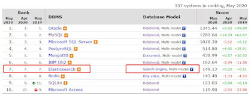
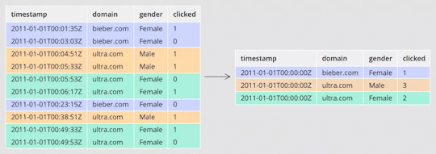
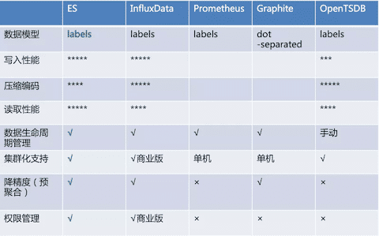
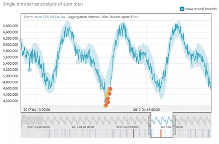

**序言**: 经常有人询问，如何学好 Elasticsearch？这个问题本质上很不好回答，但我一直又很想好好回答，所以本文就以我个人的经验视角，跟大家探讨一下如何正确的拥抱 Elasticsearch。<br><div style="float:right; padding-right:3%">\- from: dbaplus社群</div>

<br>

<!-- more -->

## 标题

::: tip 原文地址

[https://www.infoq.cn/article/QB1aL5VRkOLU3FmA3Oki](https://www.infoq.cn/article/QB1aL5VRkOLU3FmA3Oki)

此文为介绍性文章，关于ES的具体技术专题，可查看"[技术专题博客](https://heyan.site:8001/index/)"相关文章

:::

## ES 认知

### 1、ES 是什么

Elasticsearch 是什么，不同的人有不同的理解定位，之前写过 Elasticsearch 对比其它数据产品的文章[《Elasticsearch 对垒 8 大竞品技术，孰优孰劣？》](http://mp.weixin.qq.com/s?__biz=MzI4NTA1MDEwNg==&mid=2650787901&idx=1&sn=26107e829da02719546da979d50f07a8&chksm=f3f965a8c48eecbef472294ef6c5bc934e137dc7d5bfc776546f090738181947d83231096e5c&scene=21#wechat_redirect)，看了文章下面的评论，很多人定位它是搜索引擎，我觉得也很片面，下面就谈谈我的认知：

**1）Elasticsearch 是搜索引擎**

Elasticsearch 在搜索引擎数据库领域排名绝对第一，内核基于 Lucene 构建，支持全文搜索是职责所在，提供了丰富友好的 API。个人早期基于 Lucene 构建搜索应用，需要考虑的因素太多，自接触到 Elasticsearch 就再无自主开发搜索应用。普通工程师要想掌控 Lucene 需要一些代价，且很多机制并不完善，需要做大量的周边辅助程序，而 Elasticsearch 几乎都已经帮你做完了。

**2）Elasticsearch 不是搜索引擎**

说它不是搜索引擎，估计很多从业者不认可，在个人涉及到的项目中，传统意义上用 Elasticsearch 来做全文检索的项目占比越来越少，多数时候是用来做精确查询加速，查询条件很多，可以任意组合，查询速度很快，替代其它很多数据库复杂条件查询的场景需求；甚至有的数据库产品直接使用 Elasticsearch 做二级索引，如 HBase、Redis 等。Elasticsearch 由于自身的一些特性，更像一个多模数据库。

<div style="display:flex;"></div>

**3）Elasticsearch 是数据库**

Elasticsearch 使用 Json 格式来承载数据模型，已经成为事实上的文档型数据库，虽然底层存储不是 Json 格式，同类型产品有大名鼎鼎的 MongoDB，不过二者在产品定位上有差别，Elasticsearch 更加擅长的基于查询搜索的分析型数据库，倾向 OLAP；MongoDB 定位于事务型应用层面 OLTP，虽然也支持数据分析，笔者简单应用过之后再无使用，谁用谁知道。

**4）Elasticsearch 不是数据库**

Elasticsearch 不是关系型数据库，内部数据更新采用乐观锁，无严格的 ACID 事务特性，任何企图将它用在关系型数据库场景的应用都会有很多问题，很多其它领域的从业者喜欢拿这个来作为它的缺陷，重申这不是 Elasticsearch 的本质缺陷，是产品设计定位如此。

::: tip 所以

**ES 不是关系型数据库，任何非严格ACID事务场景皆可适用**

:::

### 2、ES 做什么

Elasticsearch 虽然是基于 Lucene 构建，但应用领域确实非常宽泛。

**1）全文检索**

Elasticsearch 靠全文检索起步，将 Lucene 开发包做成一个数据产品，屏蔽了 Lucene 各种复杂的设置，为开发人员提供了很友好的便利。很多传统的关系型数据库也提供全文检索，有的是基于 Lucene 内嵌，有的是基于自研，与 Elasticsearch 比较起来，功能单一，性能也表现不是很好，扩展性几乎没有。

如果，你的应用有全文检索需求，建议你优先迁移到 Elasticsearch 平台上来，其提供丰富的 Full text queries 会让你惊讶，一次用爽，一直用爽。

**2）应用查询**

Elasticsearch 最擅长的就是查询，基于倒排索引核心算法，查询性能强于 B-Tree 类型所有数据产品，尤其是关系型数据库方面。当数据量超过千万或者上亿时，数据检索的效率非常明显。

个人更看中的是 Elasticsearch 在通用查询应用场景，关系型数据库由于索引的左侧原则限制，索引执行必须有严格的顺序，如果查询字段很少，可以通过创建少量索引提高查询性能，如果查询字段很多且字段无序，那索引就失去了意义；相反 Elasticsearch 是默认全部字段都会创建索引，且全部字段查询无需保证顺序，所以我们在业务应用系统中，大量用 Elasticsearch 替代关系型数据库做通用查询，自此之后对于关系型数据库的查询就很排斥，除了最简单的查询，其余的复杂条件查询全部走 Elasticsearch。

**3）大数据领域**

Elasticserach 已经成为大数据平台对外提供查询的重要组成部分之一。大数据平台将原始数据经过迭代计算，之后结果输出到一个数据库提供查询，特别是大批量的明细数据。

这里会面临几个问题，一个问题是大批量明细数据的输出，如何能在极短的时间内写到数据库，传统上很多数据平台选择关系型数据库提供查询，比如 MySQL，之前在这方面吃过不少亏，瞬间写入性能极差，根本无法满足要求。另一个问题是对外查询，如何能像应用系统一样提供性能极好的查询，不限制查询条件，不限制字段顺序，支持较高的并发，支持海量数据快速检索，也只有 Elasticsearch 能够做到比较均衡的检索。

从官方的发布版本新特性来看，Elasticseacrch 志在大数据分析领域，提供了基于列示存储的数据聚合，支持的聚合功能非常多，性能表现也不错，笔者有幸之前大规模深度使用过，颇有感受。

Elasticsearch 为了深入数据分析领域，产品又提供了数据 Rollup 与数据 Transform 功能，让检索分析更上一层楼。在数据 Rollup 领域，Apache Druid 的竞争能力很强，笔者之前做过一些对比，单纯的比较确实不如 Druid，但自 Elasticsearch 增加了 Transfrom 功能，且单独创建了一个 Transfrom 的节点角色，个人更加看好 Elasticseach，跳出了 Rollup 基于时间序列的限制。

<div style="display:flex;"></div>

**4）日志检索**

著名的 ELK 三件套，讲的就是 Elasticsearch，Logstash，Kibana，专门针对日志采集、存储、查询设计的产品组合。很多第一次接触到 Elasticsearch 的朋友，都会以为 Elasticsearch 是专门做日志的，其实这些都是误解，只是说它很擅长这个领域，在此领域大有作为，名气很大。

日志自身特点没有什么通用的规范性，人为的随意性很大，日志内容也是任意的，更加需求全文检索能力，传统技术手段本身做全文检索很是吃力。而 Elasticsearch 本身起步就是靠全文检索，再加上其分布式架构的特性，非常符合海量日志快速检索的场景。今天如果还发现有 IT 从业人员用传统的技术手段做日志检索，应该要打屁股了。

如今已经从 ELK 三件套发展到 Elastic Stack 了，新增加了很多非常有用的产品，大大增强了日志检索领域。

**5）监控领域**

指标监控，Elasticsearch 进入此领域比较晚，却赶上了好时代，Elasticsearch 由于其倒排索引核心算法，也是支持时序数据场景的，性能也是相当不错的，在功能性上完全压住时序数据库。

Elasticsearch 搞监控得益于其提供的 Elastic Stack 产品生态，丰富完善，很多时候监控需要立体化，除了指标之外，还需要有各种日志的采集分析，如果用其它纯指标监控产品，如 Promethues，遇到有日志分析的需求，还必须使用 Elasticsearch，这对于技术栈来说，又扩增了，相应的掌控能力会下降，个人精力有限，无法同时掌握很多种数据产品，如此选择一个更加通用的产品才符合现实。

<div style="display:flex;"></div>

**6）机器学习**

机器学习最近几年风吹的很大，很多数据产品都集成了，Elasticsearch 也必须有，而且做的更好，真正将机器学习落地成为一个产品 ，简化使用，所见所得；而不像其它数据产品，仅仅集成算法包，使用者还必须开发很多应用支持。

Elasticsearch 机器学习提供了两种方式，一种是异常检测类型，属于无监督学习，采用聚类模型，通常应用在安全分析领域，检测异常访问等；一种是数据帧分析，属于分类与回归，属于监督学习，可用于在业务模型领域，如电商行业，价格模型分析。

Elasticsearch 本身是数据平台，集成了部分机器学习算法，同时又集成了 Kibana 可视化操作，使得从数据采集、到模型训练、到模型预测应用都可以一键式完成。

Elasticserach 提供的机器学习套件，个人认为最应该应用在数据质量这个领域，帮助大数据平台自动检测数据质量，从而降低人力提供效率

<div style="display:flex;"></div>

## 需求等级

Elasticsearch 整个的技术栈非常复杂，涉及到的理论与技术点非常多，完全掌握并不现实，作为一个 IT 从业者，首先是定位好自己的角色，依据角色需求去学习掌握必备的知识点。以下是笔者对于一个技术产品的划分模型：

### 1、概念

Elasticsearch 涉及到的概念很多，核心概念其实就那么几个，对于一个新手来说，掌握概念目的是为了建立起自己的知识思维模型，将之后学习到的知识点做一个很好的归纳划分；对于一个其它数据产品的老手来说 ，掌握概念的目的是为了与其它数据产品划分比较，深入的了解各自的优劣，在之后工作中若有遇到新的业务场景，可以迅速做出抉择。

IT 从业者普遍都有个感受，IT 技术发展太快了，各种技术框架产品层出不穷，学习掌握太难了，跟不上节奏。其实个人反倒觉得变化不大，基础理论核心概念并没有什么本质的发展变化，无非是工程技术实操变了很多，但这些是需要深入实践才需要的，对于概念上无需要。

作为一个技术总监，前端工程师工作 1～2 年的问题都可以问倒他，这是大家对于概念认知需求不一样。

>**ES核心概念**
>
>- 集群
>- 节点
>- 分片
>- 副本
>- 索引
>- 分段
>- 文档
>- 字段
>- 词项
>- 分词
>- 倒排
>- BKD
>- 列存

### 2、开发

开发工程师的职责是将需求变成可以落地运行的代码。Elasticsearch 的应用开发工作总结起来就是增删改查，掌握必备的 ES REST API，熟练运用足以。笔者之前任职某物流速运公司，负责 Elasticsearch 相关的工作，公司 Elasticsearch 的需求很多，尤其是查询方面，ES 最厉害的查询是 DSL，这个查询语法需要经常练习使用，否则很容易忘记，当每次有人询问时，都安排一个工程师专门负责各种解答，他在编写 DSL 方面非常熟练，帮助了很多的工程师新手使用 Elasticsearch，屏蔽了很多细节，若有一些难搞定的问题，会由我来解决，另外一方面作为负责人的我偶然还要请他帮忙编写 DSL。

Elasticsearch 后面提供了 SQL 查询的功能，但比较局限，复杂的查询聚合必须回到 DSL。

``` json
GET /product_index/product/_validate/query?explain
{
  "query": {
    "match": {
      "product_name": "toothbrush"
    }
  }
}
```

### 3、架构

Elasticsearch 集群架构总体比较复杂，首先得深入了解 Elasticseach 背后实现的原理，包括集群原理、索引原理、数据写入过程、数据查询过程等；其次要有很多案例实战的机会，遇到很多挑战问题 ，逐一排除解决，增加自己的经验。

对于开发工程师来说，满足日常需求开发无需掌握这些，但对于 Elasticsearch 技术负责人，就非常有必要了，面对各种应用需求，要能从架构思维去平衡，比如日志场景集群需求、大数据分析场景需求、应用系统复杂查询场景需求等，从实际情况设计集群架构以及资源分配等。

### 4、运维

Elasticsearch 本质是一个数据库，也需要有专门的 DBA 运维，只是更偏重应用层面，所以运维职责相对传统 DBA 没有那么严苛。对于集群层面必须掌握集群搭建，集群扩容、集群升级、集群安全、集群监控告警等；另外对于数据层面运维，必须掌握数据备份与还原、数据的生命周期管理，还有一些日常问题诊断等。

### 5、源码

Elasticsearch 本身是开源，阅读源码是个很好的学习手段，很多独特的特性官方操作文档并没有写出来，需要从源码中提炼，如集群节点之间的连接数是多少，但对于多数 Elasticsearch 从业者来说，却非必要。了解到国内主要是头部大厂需要深入源码定制化改造，更多的是集中在应用的便捷性改造，而非结构性的改造，Elastic 原厂公司有几百人的团队做产品研发，而国内多数公司就极少的人，所以从产量上来说，根本不是一个等级的。

如果把 Elasticsearch 比喻为一件军事武器，对于士兵来说 ，熟练运用才是最重要的，至于改造应该是武器制造商的职责，一个士兵可以使用很多武器装备，用最佳的组合才能打赢一场战争，而不是去深入原理然后造轮子，容易本末倒置。

### 6、算法

算法应该算是数据产品本质的区别，关系型数据库索引算法主要是基于 B-Tree， Elasticserach 索引算法主要是倒排索引，算法的本质决定了它们的应用边界，擅长的应用领域。

通常掌握一个新的数据产品时，个人的做法是看它的关键算法。早期做过一个地理位置搜索相关的项目，基于某个坐标搜索周边的坐标信息，开始的时候采用的是三角函数动态计算的方式，数据量大一点，扫描一张数据表要很久；后面接触到 Geohash 算法，按照算法将坐标编码，存储在数据库中，基于前缀匹配查询，性能高效几个数量级，感叹算法的伟大；再后面发现有专门的数据库产品集成了 Geohash 算法，使用起来就更简单了。

Elasticsearch 集成很多算法，每种算法实现都有它的应用场景。

## 拥抱 ES 的方法

### 1、官方文档

Elasticsearch 早期出过一本参考手册《Elastic 权威指南》，是一本很好的入门手册，从概念到实战都有涉及，缺点是版本针对的 2.0，过于陈旧，除去核心概念，其余的皆不适用，当前最新版本已经是 7.7 了，跨度太大，Elasticsearch 在跨度大的版本之间升级稍微比较麻烦，索引数据几乎是不兼容的，升级之后需要重建数据才可。

Elasticsearch 当前最好的参考资料是官方文档，资料最全，同步发布版本，且同时可以参考多个版本。Elasticsearch 官方参考文档也是最乱的，什么资料都有，系统的看完之后感觉仍在此山中，有点类似一本字典，看完了字典，依然写不好作文；而且资料还是英文的，至此就阻挡了国内大部分程序进入。

但想要学习 Elasticsearch，官方文档至少要看过几遍，便于迅速查询定位。

### 2、系统学习

Elasticsearch 成名很早，国内也有很多视频课程，多数比较碎片，或是纸上谈兵，缺乏实战经验。Elasticsearch 有一些专门的书籍，建议购买阅读，国内深度一些的推荐《Elasticsearch 源码解析与优化实战》，国外推荐《Elasticsearch 实战》，而且看书还有助于培养系统思维。

Elasticsearch 技术栈功能特性很多，系统学习要保持好的心态，持之以恒，需要很长时间，也需要参考很多资料。

### 3、背后原理

Elasticsearch 是站在巨人肩膀上产品，背后借鉴了很多设计思想，集成了很多算法，官方的参考文档在技术原理探讨这块并没有深入，仅仅点到为止。想要深入了解，必须得另辟蹊径。

Elastic 官方的博客有很多优质的文章，很多人因为英文的缘故会忽视掉，里面有很多关键的实现原理，图文并茂，写得非常不错；另外国内一些云厂商由于提供了 Elasticsearch 云产品，需要深度定制开发，也会有一些深入原理系列的文章，可以去阅读参考，加深理解。对于已经有比较好的编程思维的人，也可以直接去下载官方源码，设置断点调试阅读。

### 4、项目实战

项目实战是非常有效的学习途径，考过驾照的朋友都深有体会，教练一上来就直接让你操练车，通过很多次的练习就掌握了。Elasticsearch 擅长的领域很多，总结一句话就是“非强事务 ACID 场景皆可适用”，所以可以做的事情也很多。

日志领域的需求会让你对于数据写入量非常的关心，不断的调整优化策略，提高吞吐量，降低资源消耗；业务系统的需求会让你对数据一致性与时效性特别关心，从其它数据库同步到 ES，关注数据同步的速度，关注数据的准确性，不断的调整你的技术方案与策略；大数据领域的需求会让你对于查询与聚合特别关注，海量的数据需要快速的检索，也需要快速的聚合结果。

项目实战的过程，就是一个挖坑填坑的过程，实战场景多了，解决的问题多了，自然就掌握得很好了。

之前笔者在前公司任职时，所有涉及到的 Elasticsearch 疑难杂症都会找我解决，有一些项目采用别的数据产品问题比较多，也来找我评估更换 ES 是否合适，以及给出相关建议。笔者认为最好的学习方式是找到组织，找到经验丰富的大咖，持续交流学习，成长最快也最好。