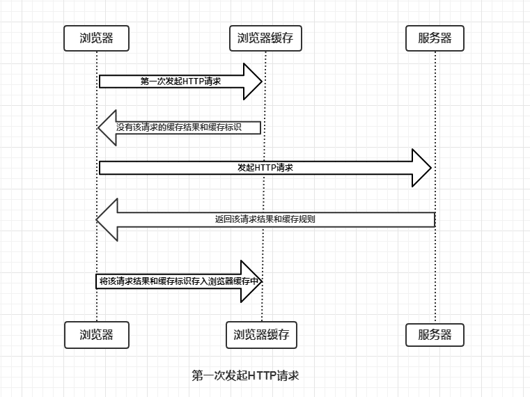
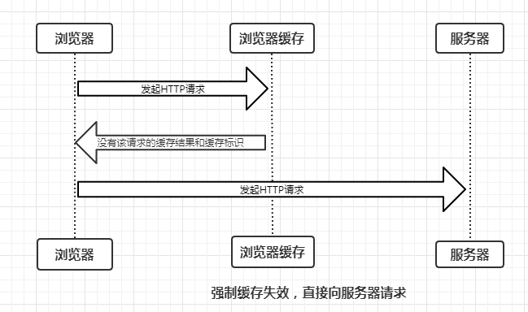
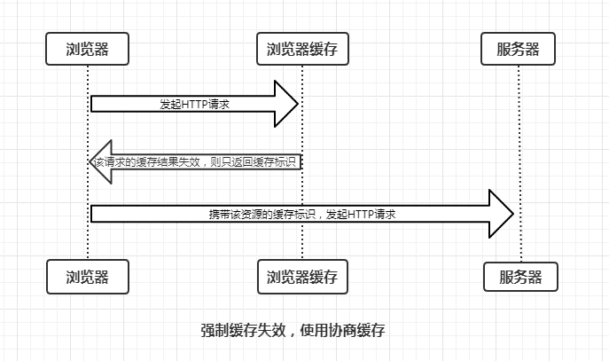
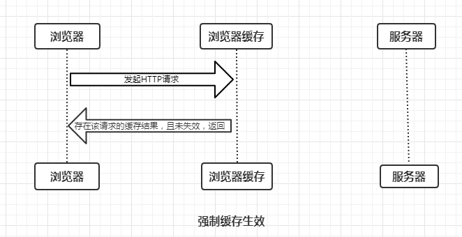
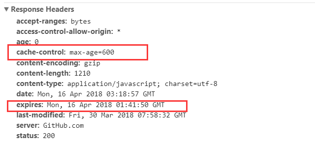
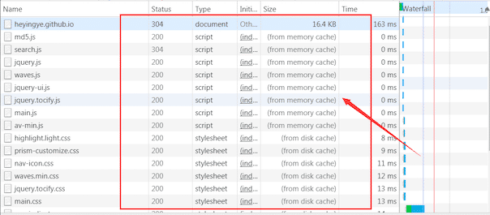
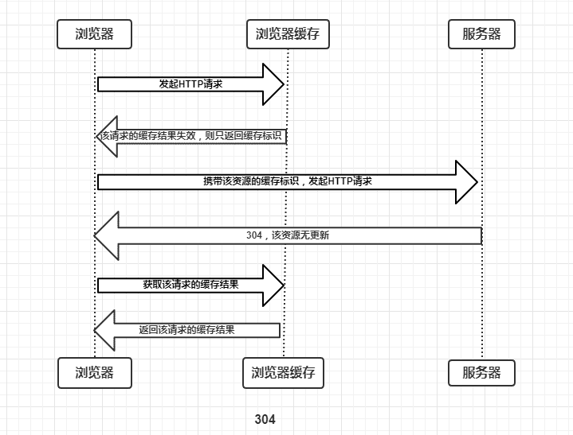
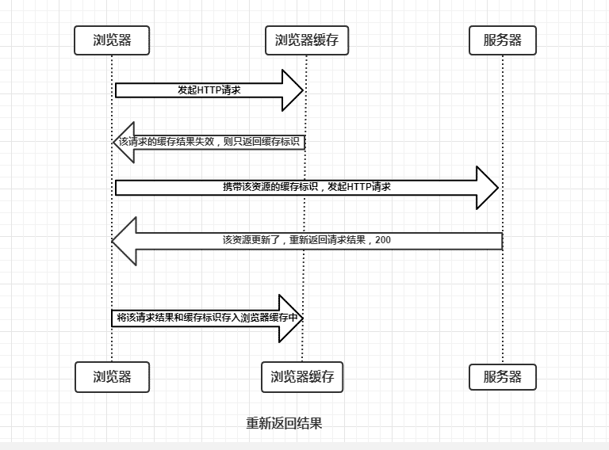
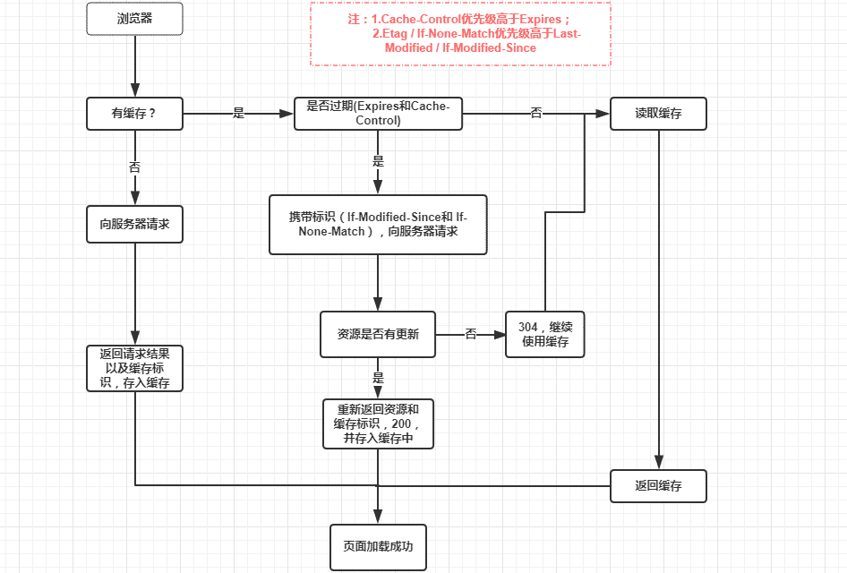

对于网站访问，什么时候静态资源（如js，css等）会走缓存？缓存有几种类型？它们的区别是什么？缓存机制是什么？

<!-- more -->

## 浏览器缓存

::: tip 转载原文

- [https://libin1991.github.io/2018/11/22/HTTP缓存机制-200还是304/](https://libin1991.github.io/2018/11/22/HTTP缓存机制-200还是304/)
- [https://heyingye.github.io/2018/04/16/彻底理解浏览器的缓存机制/](https://heyingye.github.io/2018/04/16/彻底理解浏览器的缓存机制/)
<br>

:::

当浏览器第一次加载资源的时候，返回一般为200，意思是成功获取资源，并会在浏览器的缓存中记录下max-age，第二次访问的时候： 如果只是用浏览器打开，那么浏览器会去判断这个资源在缓存里有没有，如果有的话，会去判断max-age，看看过期没有，如果没有过期，则直接读缓存，根本不会和服务器进行交互，换句话说，断网都能打开，就和本地跑一样！如果已经过期了，那就去服务器请求，等待服务器响应，这是很费时间的，服务器如果发现资源没有改变过，那么就会返回304，告诉浏览器，我没变过，你去读缓存吧，于是浏览器也不用从服务器拉数据了，然而，等待服务器响应也是一个很要命的问题，在网速发达的今天，等一个响应，有时比下载还慢。 如果是用浏览器刷新的，那么浏览器不会去判断max-age了，直接去服务器拿，如果服务器判断资源没变过，则还是会返回304，和上面是一样的，所以刷新一下，其实很可怕，等于把所有的资源都要去服务器请求一边，问问服务器我过期了没有。

浏览器在第一次请求资源的时候，服务端响应头里可以设置expires字段，该字段表示该资源的缓存过期时间，第二次请求的时候，如果时间还在该缓存时间之内，则会直接使用缓存，否则重新加载资源， **这个expires字段有个缺陷，就是它必须服务端和客户端的时间严格同步才能生效，所以现在很多人不会使用改方案。** 另外一种方案是第一次请求资源的时候，服务端设置响应头cache-control: max-age，这样设置的意思是告诉浏览器，这个资源什么时候过期，等第二次请求资源的时候，判断是否超出了过期时间，如果没超出，直接使用缓存。

### 缓存状态码 200 OK (from cache) 与 304 Not Modified

> 200 OK (from cache) 是浏览器没有跟服务器确认，直接用了浏览器缓存；

> 304 Not Modified 是浏览器和服务器多确认了一次缓存有效性，再用的缓存。

> 304 Not Modified：客户端有缓冲的文件并发出了一个条件性的请求（一般是提供If-Modified-Since头表示客户只想比指定日期更新的文档）。服务器告诉客户，原来缓冲的文档还可以继续使用。

> 304 Not Modified 比 200 OK (from cache) 慢，指的是浏览器还向服务器确认了下 “If-Not-Modified”，才用的缓存

### 200和304特点

> 状态码200：请求已成功，请求所希望的响应头或数据体将随此响应返回。即返回的数据为全量的数据，如果文件不通过GZIP压缩的话，文件是多大，则要有多大传输量。

> 状态码304：如果客户端发送了一个带条件的 GET 请求且该请求已被允许，而文档的内容（自上次访问以来或者根据请求的条件）并没有改变，则服务器应当返回这个状态码。即客户端和服务器端只需要传输很少的数据量来做文件的校验，如果文件没有修改过，则不需要返回全量的数据。

<font color=red>**状态为304的请求要比状态为200的请求的数据量小很多，因为304只需要返回响应头，并不需要返回整个文件，所以只需要几字节就可以了，这样能够节省大量的网络带宽，并减少了页面的渲染时间。**</font>

### 缓存HTTP头信息

- Date：原服务器发送该资源响应报文的时间（GMT格式）
- Age：Age表示这个响应已经存活了多久了(HTTP/1.0的响应不带Age)
- Expires：即在 HTTP 头中指明具体失效的时间(HTTP/1.0)，Expires = HTTP-date
- Pragma：no-cache，每次请求页面时都不要读缓存，兼容HTTP/1.0，优先级高于Expires(HTTP/1.0 + HTTP/1.1)
- Cache Control：优先级高于Pragma、Expires(HTTP/1.1) <font color=red>**【public，客户端和服务端都可以缓存；private，只能客户端缓存；no-store，不使用缓存；no-cache，使用协商缓存。】**</font>

#### Expires

- Expires是http1.0提出的一个表示资源过期时间的header，它描述的是一个绝对时间，由服务器返回。
- Expires第二次请求时，将和本地时间比对。

> Expires 第一次请求服务器是，响应头会返回一个Expires的文件过期时间。
> Expires 第二次请求，客户端使用本地时间和文件的过期时间进行比对，如果文件未过期则直接使用本地缓存，返回状态码200(from memory cache)或200(from disk cache)。

#### Expires Cache-Control

- Cache-Control: no-cache 必须先与代理服务器确认是否更改，然后在在决定使用缓存还是请求，类似于协商缓存（304）
- Cache-Control: no-store 才是真正的不缓存数据到本地
- Cache-Control: public 可以被所有用户缓存（多用户共享），包括终端和CDN等中间代理服务器
- Cache-Control: private 只能被终端浏览器缓存（而且是私有缓存），不允许中继缓存服务器进行缓存
- Cache-Control: must-revalidate如果缓存内容失效，请求必须发送服务器进行验证
- Cache-Control: max-age=s 缓存内容在s秒后失效，仅HTTP1.1可用

> max-gae 第一次请求服务器时，响应头会返回一个 max-age，是文件多少时间后过期。
> max-gae 第二次请求，客户端会校验文件是否过期，如果文件未过期则直接使用本地缓存，返回状态码200(from memory cache)或200(from disk cache)。

### 本地缓存和共享缓存

- 本地缓存，是指在客户端本地机器中的缓存。
- 共享缓存，处于客户端和服务器之间的缓存，例如：CDN。

### Cache Control

**请求 Cache Control**

| –              | –                                                            |
| :------------- | :----------------------------------------------------------- |
| max-age        | 可以接收缓存最长时间                                         |
| max-stale      | 可以接收过期的资源，但是过期时间必须小于 max-stale 值        |
| min-fresh      | 可以接收一个更新过的资源，fresh生命期大于其当前 Age 跟 min-fresh 值之和 |
| no-cache       | 在源服务器返回成功的验证之前不能使用缓存响应                 |
| no-store       | 直接禁止浏览器和所有中继缓存存储返回的任何版本的响应         |
| no-transform   | 获取没有被转换过（比如压缩）的资源                           |
| only-if-cached | 希望获取缓存内容而不发起请求                                 |

**响应 Cache Control**

| –                | –                                                            |
| :--------------- | :----------------------------------------------------------- |
| no-cache         | 缓存必须重新校验                                             |
| no-store         | 不存储缓存                                                   |
| no-transform     | 缓存内容时不能对改变任何数据                                 |
| public           | 响应可被任何缓存区缓存                                       |
| private          | 只在本地缓存，不允许任何中继缓存对其进行缓存（例如，浏览器可以缓存，但是CDN不能缓存） |
| must-revalidate  | 如果缓存的内容失效，请求必须发送到服务器以进行重新验证（请求失败返回504，而非中间缓存CDN） |
| proxy-revalidate | 与must-revalidate类似，仅能用于共享缓存（如：CDN）           |
| max-age          | 只接受 Age 值小于 max-age 值，并且没有过期的资源             |
| s-maxage         | 仅能用于共享缓存，一般用在cache服务器上(如：CDN)             |

**Cache Control Extensions**

通过使用1个或多个cache-extension tokens扩展（可选）字段，服务器不识别则忽略掉

```
copyCache-Control:private, community="UCI"
```

Cache-Control 允许自由组合可选值

```
copyCache-Control: max-age=3600, must-revalidate
```

**Last-Modified/If-Modified-Since**：文件最后一次修改的时间（精度是秒，HTTP/1.0），需要Cache-Contral过期

**Etag**：当前资源在服务器的唯一标识（生成规则由服务器决定）ETag的值，默认是对文件的索引节（INode），大小（Size）和最后修改时间（MTime）进行Hash后得到的，优先级高于Last-Modified；在分布式的Web系统中，当访问落在不同的物理机上时会返回不同的ETag，进而导致304失效，降级为200请求（HTTP/1.1），需要Cache-Contral过期

如果 Last-Modified 和 ETag 同时被使用，则要求它们的验证都必须通过才会返回304，否则返回200。

## 缓存过程分析

浏览器与服务器通信的方式为应答模式，即是：**浏览器发起HTTP请求 – 服务器响应该请求**。那么浏览器第一次向服务器发起该请求后拿到请求结果，会根据响应报文中HTTP头的缓存标识，决定是否缓存结果，是则将请求结果和缓存标识存入浏览器缓存中，简单的过程如下图：

<div style="display:flex;"></div>

由上图我们可以知道：

- 浏览器每次发起请求，都会先在浏览器缓存中查找该请求的结果以及缓存标识
- 浏览器每次拿到返回的请求结果都会将该结果和缓存标识存入浏览器缓存中

以上两点结论就是浏览器缓存机制的关键，他确保了每个请求的缓存存入与读取，只要我们再理解浏览器缓存的使用规则，那么所有的问题就迎刃而解了，本文也将围绕着这点进行详细分析。为了方便大家理解，这里我们根据是否需要向服务器重新发起HTTP请求将缓存过程分为两个部分，分别是**强制缓存**和**协商缓存** 。

### 强制缓存

**强制缓存就是向浏览器缓存查找该请求结果，并根据该结果的缓存规则来决定是否使用该缓存结果的过程**，强制缓存的情况主要有三种(暂不分析协商缓存过程)，如下：

- 不存在该缓存结果和缓存标识，强制缓存失效，则直接向服务器发起请求（跟第一次发起请求一致），如下图：

<div style="display:flex;"></div>

- 存在该缓存结果和缓存标识，但该结果已失效，强制缓存失效，则使用协商缓存(暂不分析)，如下图:

<div style="display:flex;"></div>

- 存在该缓存结果和缓存标识，且该结果尚未失效，强制缓存生效，直接返回该结果，如下图

<div style="display:flex;"></div>

> 那么强制缓存的缓存规则是什么？

当浏览器向服务器发起请求时，服务器会将缓存规则放入HTTP响应报文的HTTP头中和请求结果一起返回给浏览器，控制强制缓存的字段分别是**Expires**和**Cache-Control**，其中Cache-Control优先级比Expires高。

#### Expires

Expires是HTTP/1.0控制网页缓存的字段，其值为服务器返回该请求结果缓存的到期时间，即再次发起该请求时，如果客户端的时间小于Expires的值时，直接使用缓存结果。

> Expires是HTTP/1.0的字段，但是现在浏览器默认使用的是HTTP/1.1，那么在HTTP/1.1中网页缓存还是否由Expires控制？

到了HTTP/1.1，<font color=red>Expire已经被Cache-Control替代</font>，原因在于Expires控制缓存的原理是使用客户端的时间与服务端返回的时间做对比，那么如果客户端与服务端的时间因为某些原因（例如时区不同；客户端和服务端有一方的时间不准确）发生误差，那么强制缓存则会直接失效，这样的话强制缓存的存在则毫无意义，那么Cache-Control又是如何控制的呢？

#### Cache-Control

在HTTP/1.1中，Cache-Control是最重要的规则，主要用于控制网页缓存，主要取值为：

- **public**：所有内容都将被缓存（客户端和代理服务器都可缓存）
- **private**：所有内容只有客户端可以缓存，**Cache-Control的默认取值**
- **no-cache**：客户端缓存内容，但是是否使用缓存则需要经过协商缓存来验证决定
- **no-store**：所有内容都不会被缓存，即不使用强制缓存，也不使用协商缓存
- **max-age=xxx (xxx is numeric)**：缓存内容将在xxx秒后失效

接下来，我们直接看一个例子，如下：

<div style="display:flex;"></div>

由上面的例子我们可以知道：

- HTTP响应报文中expires的时间值，是一个绝对值
- HTTP响应报文中Cache-Control为max-age=600，是相对值

由于Cache-Control的优先级比expires，那么直接根据Cache-Control的值进行缓存，意思就是说在600秒内再次发起该请求，则会直接使用缓存结果，强制缓存生效。

注：在无法确定客户端的时间是否与服务端的时间同步的情况下，Cache-Control相比于expires是更好的选择，所以同时存在时，只有Cache-Control生效。

了解强制缓存的过程后，我们拓展性的思考一下：

> 浏览器的缓存存放在哪里，如何在浏览器中判断强制缓存是否生效？

<div style="display:flex;"></div>

这里我们以博客的请求为例，状态码为灰色的请求则代表使用了强制缓存，请求对应的Size值则代表该缓存存放的位置，分别为**from memory cache** 和 **from disk cache**。

> 那么from memory cache 和 from disk cache又分别代表的是什么呢？什么时候会使用from disk cache，什么时候会使用from memory cache呢？

from memory cache代表使用内存中的缓存，from disk cache则代表使用的是硬盘中的缓存，浏览器读取缓存的顺序为memory –> disk。

虽然我已经直接把结论说出来了，但是相信有不少人对此不能理解，那么接下来我们一起详细分析一下缓存读取问题，这里仍让以我的博客为例进行分析：
**访问https://heyingye.github.io/ –> 200 –> 关闭博客的标签页 –> 重新打开https://heyingye.github.io/ –> 200(from disk cache) –> 刷新 –> 200(from memory cache)**

> 看到这里可能有人小伙伴问了，最后一个步骤刷新的时候，不是同时存在着from disk cache和from memory cache吗？

对于这个问题，我们需要了解内存缓存(from memory cache)和硬盘缓存(from disk cache)，如下:

- **内存缓存(from memory cache)**：内存缓存具有两个特点，分别是**快速读取**和**时效性**：
  - **快速读取**：内存缓存会将编译解析后的文件，直接存入该进程的内存中，占据该进程一定的内存资源，以方便下次运行使用时的快速读取。
  - **时效性**：一旦该进程关闭，则该进程的内存则会清空。
- **硬盘缓存(from disk cache)**：硬盘缓存则是直接将缓存写入硬盘文件中，读取缓存需要对该缓存存放的硬盘文件进行I/O操作，然后重新解析该缓存内容，读取复杂，速度比内存缓存慢。

在浏览器中，浏览器会在js和图片等文件解析执行后直接存入内存缓存中，那么当刷新页面时只需直接从内存缓存中读取(from memory cache)；而css文件则会存入硬盘文件中，所以每次渲染页面都需要从硬盘读取缓存(from disk cache)。

### 协商缓存

**协商缓存就是强制缓存失效后，浏览器携带缓存标识向服务器发起请求，由服务器根据缓存标识决定是否使用缓存的过程**，主要有以下两种情况：

- 协商缓存生效，返回304，如下

<div style="display:flex;"></div>

- 协商缓存失效，返回200和请求结果结果，如下

<div style="display:flex;"></div>

同样，协商缓存的标识也是在响应报文的HTTP头中和请求结果一起返回给浏览器的，控制协商缓存的字段分别有：**Last-Modified / If-Modified-Since和Etag / If-None-Match**，其中Etag / If-None-Match的优先级比Last-Modified / If-Modified-Since高。

#### Last-Modified / If-Modified-Since

- Last-Modified是服务器响应请求时，返回该资源文件在服务器最后被修改的时间。[*Response Headers中*]
- If-Modified-Since则是客户端再次发起该请求时，携带上次请求返回的Last-Modified值，通过此字段值告诉服务器该资源上次请求返回的最后被修改时间。服务器收到该请求，发现请求头含有If-Modified-Since字段，则会根据If-Modified-Since的字段值与该资源在服务器的最后被修改时间做对比，若服务器的资源最后被修改时间大于If-Modified-Since的字段值，则重新返回资源，状态码为200；否则则返回304，代表资源无更新，可继续使用缓存文件。[*Request Headers中*]

#### Etag / If-None-Match

- Etag是服务器响应请求时，返回当前资源文件的一个唯一标识(由服务器生成)。[*Response Headers中*]
- If-None-Match是客户端再次发起该请求时，携带上次请求返回的唯一标识Etag值，通过此字段值告诉服务器该资源上次请求返回的唯一标识值。服务器收到该请求后，发现该请求头中含有If-None-Match，则会根据If-None-Match的字段值与该资源在服务器的Etag值做对比，一致则返回304，代表资源无更新，继续使用缓存文件；不一致则重新返回资源文件，状态码为200。[*Request Headers中*]

> **注：Etag / If-None-Match优先级高于Last-Modified / If-Modified-Since，同时存在则只有Etag / If-None-Match生效。**

## 总结

强制缓存优先于协商缓存进行，若强制缓存(Expires和Cache-Control)生效则直接使用缓存，若不生效则进行协商缓存(Last-Modified / If-Modified-Since和Etag / If-None-Match)，协商缓存由服务器决定是否使用缓存，若协商缓存失效，那么代表该请求的缓存失效，重新获取请求结果，再存入浏览器缓存中；生效则返回304，继续使用缓存，主要过程如下：

<div style="display:flex;"></div>