什么是云原生？云原生包含了哪些技术？

<!-- more -->

::: tip 参考、转载

- [https://www.cncf.io/](https://www.cncf.io/)
- [https://www.sohu.com/a/392270381_640930](https://www.sohu.com/a/392270381_640930)
- [https://www.sohu.com/a/255051873_160923](https://www.sohu.com/a/255051873_160923)

:::

::: warning

云原生技术是一个快速发展的技术，本身的定义和理解会随着新技术、理念的诞生而作出相应的调整。所以本文中的知识点只是在当前时间点上的参考介绍。

:::

## **云原生的诞生**

随着虚拟化技术的成熟和分布式框架的普及，在容器技术、可持续交付、编排系统等开源社区的推动下，以及微服务等开发理念的带动下，应用上云已经是不可逆转的趋势。

云计算的3层划分，即基础设施即服务(IaaS)、平台即服务(PaaS)、软件即服务(SaaS)为云原生提供了技术基础和方向指引，真正的云化不仅仅是基础设施和平台的变化，应用也需要做出改变，摈弃传统的土方法，在架构设计、开发方式、部署维护等各个阶段和方面都基于云的特点，重新设计，从而建设全新的云化的应用，即云原生应用。

**云原生的发展史**

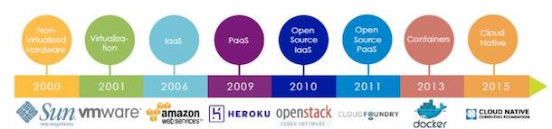

**云原生（Cloud Native）概念**

由来自Pivotal的MattStine于2013年首次提出，被一直延续使用至今。这个概念是Matt Stine根据其多年的架构和咨询经验总结出来的一个思想集合，并得到了社区的不断完善，内容非常多，包括DevOps、持续交付（Continuous Delivery）、微服务（MicroServices）、敏捷基础设施（Agile Infrastructure）和12要素（The Twelve-Factor App - 如下图）等几大主题，不但包括根据业务能力对公司进行文化、组织架构的重组与建设，也包括方法论与原则，还有具体的操作工具。采用基于云原生的技术和管理方法，可以更好地把业务生于“云”或迁移到云平台，从而享受“云”的高效和持续的服务能力。

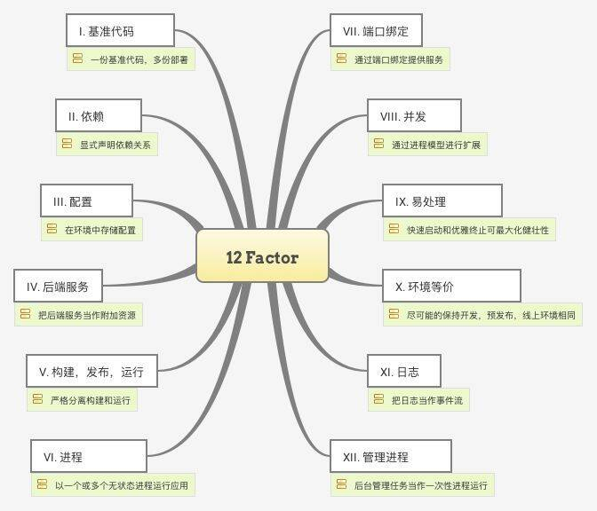

顾名思义，云原生是面向“云”而设计的应用，因此技术部分依赖于传统云计算的3层概念，基础设施即服务（IaaS）、平台即服务（PaaS）和软件即服务（SaaS），例如，敏捷的不可变基础设施交付类似于IaaS，用来提供计算网络存储等基础资源，这些资源是可编程且不可变的，直接通过API可以对外提供服务；有些应用通过PaaS服务本来就能组合成不同的业务能力，不一定需要从头开始建设；还有一些软件只需要“云”的资源就能直接运行起来为云用户提供服务，即SaaS能力，用户直接面对的就是原生的应用。

## CNCF

随着云原生概念的提出与发展，2015年7月由Google 牵头，成立云原生基金会（CNCF）,隶属于 Linux 基金会

> CNCF概况，具体细节可查看官方ppt - [https://github.com/cncf/presentations](https://github.com/cncf/presentations)

### **CNCF项目成熟度划分**

- 毕业项目
  - 截止目前，已经毕业的项目有十几个。其中包括众所周知的Kubnetes、Promethes、containerd、Fluentd等一众明星产品。
- 孵化项目
  - 包括了在专题文章中介绍的etcd，服务网格Linkerd，远程调用gRPC，边缘计算（华为）KubeEdge等等冉冉升起的新星
- 沙箱项目

 

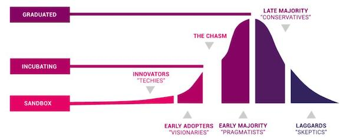

 

### **CNCF Cloud Native Trail Map**

CNCN官方提供的云原生路线图

我们可以从中看到云原生的主要技术栈 - 容器化、CI/CD、编排、监控分析、微服务（发现、代理、服务网格）、网络安全、分布式存储、流处理平台、容器运行时、软件发布等

> 最新路线图：	[https://github.com/cncf/landscape](https://github.com/cncf/landscape)

 

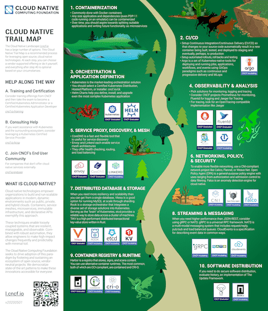

 

### CNCF Cloud Native Landscape 

>  
>
> **直接查看最新的项目全景图**：
>
>  
>
> [https://landscape.cncf.io/](https://landscape.cncf.io/)
>
> - 包含Cloud Native Serviceless Landscape

 

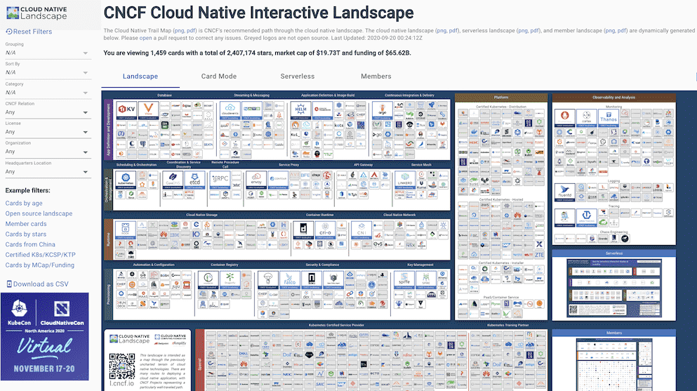

 

## 云原生技术定义

### CNCF 官方定义

下面是来自CNCF对“Cloud Native”的定义：

> 云原生技术有利于各组织在公有云、私有云和混合云等新型动态环境中，构建和运行可弹性扩展的应用。云原生的代表技术包括容器、服务网格、微服务、不可变基础设施和声明式API。
>
> 这些技术能够构建容错性好、易于管理和便于观察的松耦合系统。结合可靠的自动化手段，云原生技术使工程师能够轻松地对系统作出频繁和可预测的重大变更。
>
> 云原生计算基金会（CNCF）致力于培育和维护一个厂商中立的开源生态系统，来推广云原生技术。我们通过将最前沿的模式民主化，让这些创新为大众所用。

从官方定义中，我们大概看到几个关键技术：容器、微服务、服务网格、声明式API、不可变的基础设施、可靠的自动化技术。

### 网络流行定义

另外一种比较主流的说法是云原生 = 微服务+DevOps+持续交付+容器化，广泛的见诸于各种文章和资料。

 

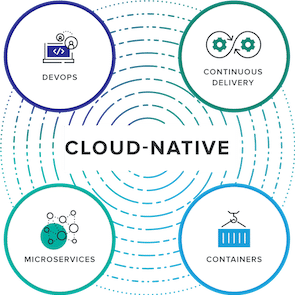

 

云原生从字面意思上来看可以分成**云**和**原生**两个部分。

- 云是和本地相对的，传统的应用必须跑在本地服务器上，现在流行的应用都跑在云端，云包含了IaaS,、PaaS和SaaS。
- 原生就是土生土长的意思，我们在开始设计应用的时候就考虑到应用将来是运行云环境里面的，要充分利用云资源的优点，比如️云服务的**弹性**和**分布式**优势。

**云原生并不是一个产品**

关于云原生应用，简单地说，就是大多数传统的应用，不做任何改动，都是可以在云平台运行起来，只要云平台支持这个传统应用所运行的计算机架构和操作系统。只不过这种运行模式，仅仅是把虚拟机当物理机一样使用，不能够真正利用起来云平台的能力。

云并非把原先在物理服务器上跑的东西放到虚拟机里跑，真正的云化不仅是基础设施和平台的事情，应用也要做出改变，改变传统的做法，实现云化的应用——应用的架构、应用的开发方式、应用部署和维护技术都要做出改变，真正的发挥云的弹性、动态调度、自动伸缩……一些传统IT所不具备的能力。这里说的“云化的应用”也就是“云原生应用”。云原生架构和云原生应用所涉及的技术很多，如容器技术、微服务、可持续交付、DevOps等。

而云原生应用最大的特点就是可以迅速部署新业务。在企业里，提供新的应用程序环境及部署软件新版本通常所需时间以日、周甚至以月计算。这种速度严重限制了软件发布所能承受的风险，因为犯错及改错也需要花费同样的时间成本，竞争优势就会由此产生。

**所以云原生不是一个产品，而是一套技术体系和一套方法论，而数字化转型是思想先行，从内到外的整体变革。更确切地说，它是一种文化，更是一种潮流，是云计算的一个必然导向**。意义在于让云成为云化战略成功的基石，而不是障碍。它可以根据商业能力对公司进行重组的能力，既包含技术、也包含管理，可以说是一系列云技术和企业管理方法的集合，通过实践及与其他工具相结合更好地帮助用户实现数字化转型。

### Definition from Microsoft

::: tip 转载自微软对于Cloud Native的定义

- [https://docs.microsoft.com/en-us/dotnet/architecture/cloud-native/definition](https://docs.microsoft.com/en-us/dotnet/architecture/cloud-native/definition)

:::

Applications have become increasingly complex with users demanding more and more. Users expect rapid responsiveness, innovative features, and zero downtime. Performance problems, recurring errors, and the inability to move fast are no longer acceptable. They'll easily move to your competitor.

Cloud native is much about *speed* and *agility*. Business systems are evolving from enabling business capabilities to weapons of strategic transformation, accelerating business velocity and growth. It's imperative to get ideas to market immediately.

The speed and agility of cloud native come about from a number of factors. Foremost is cloud infrastructure. Five additional foundational pillars shown in below picture, also provide the bedrock for cloud-native systems.

> ( - *google translate*
>
> 随着用户的需求越来越大，应用程序变得越来越复杂。 用户期望快速响应，创新功能和零停机时间。 性能问题，重复出现的错误以及无法快速移动不再被接受。 他们将轻松转移到您的竞争对手。
>
> Cloud native是关于“速度”和“敏捷性”的。 业务系统正在从启用业务功能演变为战略转型的武器，从而加快了业务速度和增长。 必须立即将创意推向市场.
>
> 云原生的速度和敏捷性来自多种因素。 首先是云基础架构。 下图所示的五个其他基础支柱也为云原生系统提供了基础。
>
> )

*Cloud-native foundational pillars*

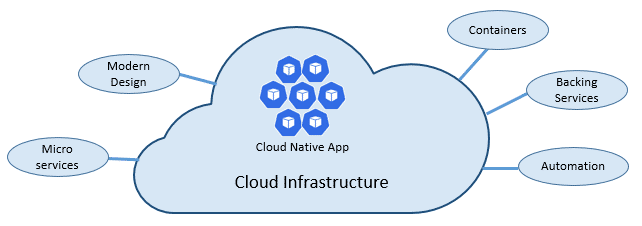

Let's take some time to better understand the significance of each pillar.

#### The cloud…

Cloud-native systems take full advantage of the cloud service model.

Designed to thrive in a dynamic, virtualized cloud environment, these systems make extensive use of [Platform as a Service (PaaS)] compute infrastructure and managed services. They treat the underlying infrastructure as *disposable* - provisioned in minutes and resized, scaled, moved, or destroyed on demand – via automation.

Consider the widely accepted DevOps concept of [Pets vs. Cattle](https://medium.com/@Joachim8675309/devops-concepts-pets-vs-cattle-2380b5aab313). In a traditional data center, servers are treated as *Pets*: a physical machine, given a meaningful name, and cared for. You scale by adding more resources to the same machine (scaling up). If the server becomes sick, you nurse it back to health. Should the server become unavailable, everyone notices.

The *Cattle* service model is different. You provision each instance as a virtual machine or container. They're identical and assigned a system identifier such as Service-01, Service-02, and so on. You scale by creating more of them (scaling out). When one becomes unavailable, nobody notices.

The cattle model embraces *immutable infrastructure*. Servers aren't repaired or modified. If one fails or requires updating, it's destroyed and a new one is provisioned – all done via automation.

Cloud-native systems embrace the Cattle service model. They continue to run as the infrastructure scales in or out with no regard to the machines upon which they're running.

> ( - *google translate*
>
> 云原生系统充分利用了云服务模型。
>
> 这些系统旨在在动态，虚拟化的云环境中蓬勃发展，广泛使用了平台即服务（PaaS）计算基础架构和托管服务。他们将基础架构视为一次性的，只需几分钟即可配置，并通过自动化按需调整大小，缩放，移动或销毁。
>
> 考虑一下“Pets vs. Cattle”这一广为接受的DevOps概念。在传统的数据中心中，服务器被视为“Pets”：物理机，被赋予了有意义的名称并得到了照顾。您可以通过向同一台计算机添加更多资源来进行扩展（向上扩展）。如果服务器生病，则可以将其恢复健康。如果服务器不可用，每个人都会注意到。
>
> Cattle服务模式有所不同。您将每个实例配置为虚拟机或容器。它们是相同的，并分配了系统标识符，例如Service-01，Service-02等。您可以通过创建更多（扩展）来进行扩展。当一个人不可用时，没人注意到。
>
> Cattle模型包含不变的基础架构。不能修复或修改服务器。如果其中一项失败或需要更新，则将其销毁并置备新的-所有这些都通过自动化完成。
>
> 云原生系统采用Cattle服务模型。它们会随着基础结构的扩展或扩展而继续运行，而与它们所运行的计算机无关。
>
> )

#### Modern design

How would you design a cloud-native app? What would your architecture look like? To what principles, patterns, and best practices would you adhere? What infrastructure and operational concerns would be important?

**The Twelve-Factor Application**

A widely accepted methodology for constructing cloud-based applications is the [Twelve-Factor Application](https://12factor.net/). It describes a set of principles and practices that developers follow to construct applications optimized for modern cloud environments. Special attention is given to portability across environments and declarative automation.

While applicable to any web-based application, many practitioners consider Twelve-Factor as a solid foundation for building cloud-native apps. Systems built upon these principles can deploy and scale rapidly and add features to react quickly to market changes.

The following table highlights the Twelve-Factor methodology:

|      | Factor              | Explanation                                                  |
| :--- | :------------------ | :----------------------------------------------------------- |
| 1    | Code Base           | A single code base for each microservice, stored in its own repository. Tracked with version control, it can deploy to multiple environments (QA, Staging, Production). |
| 2    | Dependencies        | Each microservice isolates and packages its own dependencies, embracing changes without impacting the entire system. |
| 3    | Configurations      | Configuration information is moved out of the microservice and externalized through a configuration management tool outside of the code. The same deployment can propagate across environments with the correct configuration applied. |
| 4    | Backing Services    | Ancillary resources (data stores, caches, message brokers) should be exposed via an addressable URL. Doing so decouples the resource from the application, enabling it to be interchangeable. |
| 5    | Build, Release, Run | Each release must enforce a strict separation across the build, release, and run stages. Each should be tagged with a unique ID and support the ability to roll back. Modern CI/CD systems help fulfill this principle. |
| 6    | Processes           | Each microservice should execute in its own process, isolated from other running services. Externalize required state to a backing service such as a distributed cache or data store. |
| 7    | Port Binding        | Each microservice should be self-contained with its interfaces and functionality exposed on its own port. Doing so provides isolation from other microservices. |
| 8    | Concurrency         | Services scale out across a large number of small identical processes (copies) as opposed to scaling-up a single large instance on the most powerful machine available. |
| 9    | Disposability       | Service instances should be disposable, favoring fast startups to increase scalability opportunities and graceful shutdowns to leave the system in a correct state. Docker containers along with an orchestrator inherently satisfy this requirement. |
| 10   | Dev/Prod Parity     | Keep environments across the application lifecycle as similar as possible, avoiding costly shortcuts. Here, the adoption of containers can greatly contribute by promoting the same execution environment. |
| 11   | Logging             | Treat logs generated by microservices as event streams. Process them with an event aggregator and propagate the data to data-mining/log management tools like Azure Monitor or Splunk and eventually long-term archival. |
| 12   | Admin Processes     | Run administrative/management tasks as one-off processes. Tasks can include data cleanup and pulling analytics for a report. Tools executing these tasks should be invoked from the production environment, but separately from the application. |

In the book, [Beyond the Twelve-Factor App](https://content.pivotal.io/blog/beyond-the-twelve-factor-app), author Kevin Hoffman details each of the original 12 factors (written in 2011). Additionally, he discusses three additional factors that reflect today's modern cloud application design.

|      | New Factor                    | Explanation                                                  |
| :--- | :---------------------------- | :----------------------------------------------------------- |
| 13   | API First                     | Make everything a service. Assume your code will be consumed by a front-end client, gateway, or another service. |
| 14   | Telemetry                     | On a workstation, you have deep visibility into your application and its behavior. In the cloud, you don't. Make sure your design includes the collection of monitoring, domain-specific, and health/system data. |
| 15   | Authentication/ Authorization | Implement identity from the start. Consider [RBAC (role-based access control)](https://docs.microsoft.com/en-us/azure/role-based-access-control/overview) features available in public clouds. |

**Critical Design Considerations**

Beyond the guidance provided from the twelve-factor methodology, there are several critical design decisions you must make when constructing distributed systems.

*Communication*

How will front-end client applications communicate with backed-end core services? Will you allow direct communication? Or, might you abstract the back-end services with a gateway façade that provides flexibility, control, and security? How will back-end core services communicate with each other? Will you allow direct HTTP calls that lead to coupling and impact performance and agility? Or might you consider decoupled messaging with queue and topic technologies?

*Resiliency*

A microservices architecture moves your system from in-process to out-of-process network communication. In a distributed architecture, what happens when Service B isn't responding to a network call from Service A? Or, what happens when Service C becomes temporarily unavailable and other services calling it are blocked?

*Distributed Data*

By design, each microservice encapsulates its own data, exposing operations via its public interface. If so, how do you query data or implement a transaction across multiple services?

*Identity*

How will your service identify who is accessing it and what permissions they have?

#### Microservices

Cloud-native systems embrace microservices, a popular architectural style for constructing modern applications.

Built as a distributed set of small, independent services that interact through a shared fabric, microservices share the following characteristics:

- Each implements a specific business capability within a larger domain context.
- Each is developed autonomously and can be deployed independently.
- Each is self-contained encapsulating its own data storage technology (SQL, NoSQL) and programming platform.
- Each runs in its own process and communicates with others using standard communication protocols such as HTTP/HTTPS, WebSockets, or [AMQP](https://en.wikipedia.org/wiki/Advanced_Message_Queuing_Protocol).
- They compose together to form an application.

below picture contrasts a monolithic application approach with a microservices approach. Note how the monolith is composed of a layered architecture, which executes in a single process. It typically consumes a relational database. The microservice approach, however, segregates functionality into independent services that include logic and data. Each microservice hosts its own datastore.

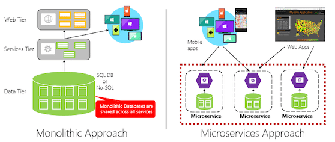

Note how microservices promote the "One Codebase, One Application" principle from the [Twelve-Factor Application](https://12factor.net/), discussed earlier in the chapter.

> *Factor #1 specifies "A single codebase for each microservice, stored in its own repository. Tracked with version control, it can deploy to multiple environments."*

**Why microservices?**

Microservices provide agility.

Earlier in the chapter, we compared an eCommerce application built as a monolith to that with microservices. In the example, we saw some clear benefits:

- Each microservice has an autonomous lifecycle and can evolve independently and deploy frequently. You don't have to wait for a quarterly release to deploy a new features or update. You can update a small area of a complex application with less risk of disrupting the entire system.
- Each microservice can scale independently. Instead of scaling the entire application as a single unit, you scale out only those services that require more processing power or network bandwidth. This fine-grained approach to scaling provides for greater control of your system and helps to reduce overall costs as you scale portions of your system, not everything.

#### Containers

Nowadays, it's natural to hear the term *container* mentioned in any conversation concerning *cloud native*. In the book, [Cloud Native Patterns](https://www.manning.com/books/cloud-native-patterns), author Cornelia Davis observes that, "Containers are a great enabler of cloud-native software." The Cloud Native Computing Foundation places microservice containerization as the first step in their [Cloud-Native Trail Map](https://raw.githubusercontent.com/cncf/trailmap/master/CNCF_TrailMap_latest.png) - guidance for enterprises beginning their cloud-native journey.

Containerizing a microservice is simple and straightforward. The code, its dependencies, and runtime are packaged into a binary called a [container image](https://docs.docker.com/glossary/?term=image). Images are stored in a [container registry](https://caylent.com/container-registries/), which acts as a repository or library for images. A registry can be located on your development computer, in your data center, or in a public cloud. Docker itself maintains a public registry via [Docker Hub](https://hub.docker.com/). The Azure cloud features a [container registry](https://azure.microsoft.com/services/container-registry/) to store container images close to the cloud applications that will run them.

When needed, you transform the image into a running container instance. The instance runs on any computer that has a [container runtime](https://kubernetes.io/docs/setup/production-environment/container-runtimes/) engine installed. You can have as many instances of the containerized service as needed.

> ( - *google translate*
>
> 如今，很自然地会听到任何有关云原生的对话中提到的容器一词。在《 Cloud Native Patterns》一书中，作者Cornelia Davis指出：“容器是云原生软件的强大支持者。” Cloud Native Computing Foundation将微服务容器化作为其Cloud-Native Trail Map的第一步-为企业开始其云原生之旅的指南。
>
> 容器化微服务既简单又直接。该代码，其依赖项和运行时被打包到一个称为容器映像的二进制文件中。图像存储在容器注册表中，该容器充当图像的存储库或库。注册表可以位于开发计算机，数据中心或公共云中。 Docker本身通过Docker Hub维护一个公共注册表。 Azure云具有容器注册表，可将容器映像存储在将运行它们的云应用程序附近。
>
> 在需要时，将映像转换为正在运行的容器实例。该实例可在装有容器运行时引擎的任何计算机上运行。您可以根据需要具有任意数量的容器化服务实例。
>
> )

*below shows three different microservices, each in its own container, running on a single host.*

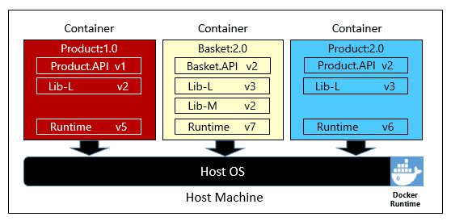

Note how each container maintains its own set of dependencies and runtime, which can be different. Here, we see different versions of the Product microservice running on the same host. Each container shares a slice of the underlying host operating system, memory, and processor, but is isolated from one another.

Note how well the container model embraces the "Dependencies" principle from the [Twelve-Factor Application](https://12factor.net/).

> *Factor #2 specifies that "Each microservice isolates and packages its own dependencies, embracing changes without impacting the entire system."*

While several container vendors exist, Docker has captured the lion's share of the market. The company has been driving the software container movement. It has become the de facto standard for packaging, deploying, and running cloud-native applications.

**Why containers?**

Containers provide portability and guarantee consistency across environments. By encapsulating everything into a single package, you *isolate* the microservice and its dependencies from the underlying infrastructure.

You can deploy that same container in any environment that has the Docker runtime engine. Containerized workloads also eliminate the expense of pre-configuring each environment with frameworks, software libraries, and runtime engines.

By sharing the underlying operating system and host resources, containers have a much smaller footprint than a full virtual machine. The smaller size increases the *density*, or number of microservices, that a given host can run at one time.

**Container orchestration**

While tools such as Docker create images and run containers, you also need tools to manage them. Container management is done with a special software program called a container orchestrator. When operating at scale, container orchestration is essential.

*below shows management tasks that container orchestrators provide.*

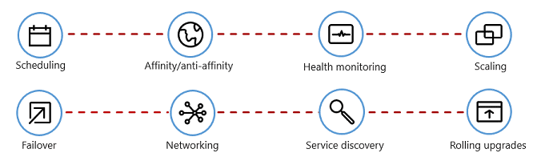

The following table describes common orchestration tasks.

| Tasks                  | Explanation                                                  |
| :--------------------- | :----------------------------------------------------------- |
| Scheduling             | Automatically provision container instances.                 |
| Affinity/anti-affinity | Provision containers nearby or far apart from each other, helping availability and performance. |
| Health monitoring      | Automatically detect and correct failures.                   |
| Failover               | Automatically reprovision failed instance to healthy machines. |
| Scaling                | Automatically add or remove container instance to meet demand. |
| Networking             | Manage a networking overlay for container communication.     |
| Service Discovery      | Enable containers to locate each other.                      |
| Rolling Upgrades       | Coordinate incremental upgrades with zero downtime deployment. Automatically roll back problematic changes. |

Note how orchestrators embrace the disposability and concurrency principles from the [Twelve-Factor Application](https://12factor.net/), discussed earlier in the chapter.

> *Factor #9 specifies that "Service instances should be disposable, favoring fast startups to increase scalability opportunities and graceful shutdowns to leave the system in a correct state. Docker containers along with an orchestrator inherently satisfy this requirement."*

> *Factor #8 specifies that "Services scale out across a large number of small identical processes (copies) as opposed to scaling-up a single large instance on the most powerful machine available."*

While several container orchestrators exist, [Kubernetes](https://kubernetes.io/docs/concepts/overview/what-is-kubernetes/) has become the de facto standard for the cloud-native world. It's a portable, extensible, open-source platform for managing containerized workloads.

#### Backing services

Cloud-native systems depend upon many different ancillary resources, such as data stores, message brokers, monitoring, and identity services. These services are known as [backing services](https://12factor.net/backing-services).

*below shows many common backing services that cloud-native systems consume.*

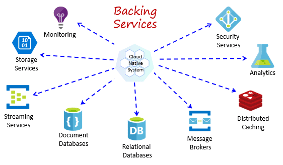

Backing services promote the "Statelessness" principle from the [Twelve-Factor Application](https://12factor.net/), discussed earlier in the chapter.

> *Factor #6* specifies that, "Each microservice should execute in its own process, isolated from other running services. Externalize required state to a backing service such as a distributed cache or data store."

You could host your own backing services, but then you'd be responsible for licensing, provisioning, and managing those resources.

Cloud providers offer a rich assortment of *managed backing services.* Instead of owning the service, you simply consume it. The provider operates the resource at scale and bears the responsibility for performance, security, and maintenance. Monitoring, redundancy, and availability are built into the service. Providers fully support their managed services - open a ticket and they fix your issue.

Cloud-native systems favor managed backing services from cloud vendors. The savings in time and labor are great. The operational risk of hosting your own and experiencing trouble can get expensive fast.

A best practice is to treat a backing service as an *attached resource*, dynamically bound to a microservice with information (a URL and credentials) stored in an external configuration. This guidance is spelled out in the [Twelve-Factor Application](https://12factor.net/), discussed earlier in the chapter.

> *Factor #4* specifies that backing services "should be exposed via an addressable URL. Doing so decouples the resource from the application, enabling it to be interchangeable."

> *Factor #3* specifies that "Configuration information is moved out of the microservice and externalized through a configuration management tool outside of the code."

With this pattern, a backing service can be attached and detached without code changes. You might promote a microservice from QA to a staging environment. You update the microservice configuration to point to the backing services in staging and inject the settings into your container through an environment variable.

Cloud vendors provide APIs for you to communicate with their proprietary backing services. These libraries encapsulate the plumbing and complexity. Communicating directly with these APIs will tightly couple your code to the backing service. It's a better practice to insulate the implementation details of the vendor API. Introduce an intermediation layer, or intermediate API, exposing generic operations to your service code. This loose coupling enables you to swap out one backing service for another or move your code to a different public cloud without having to make changes to the mainline service code.

#### Automation

As you've seen, cloud-native systems embrace microservices, containers, and modern system design to achieve speed and agility. But, that's only part of the story. How do you provision the cloud environments upon which these systems run? How do you rapidly deploy app features and updates? How do you round out the full picture?

Enter the widely accepted practice of [Infrastructure as Code](https://docs.microsoft.com/en-us/azure/devops/learn/what-is-infrastructure-as-code), or IaC.

With IaC, you automate platform provisioning and application deployment. You essentially apply software engineering practices such as testing and versioning to your DevOps practices. Your infrastructure and deployments are automated, consistent, and repeatable.

**Automating infrastructure**

Tools like Azure Resource Manager, Terraform, and the Azure CLI, enable you to declaratively script the cloud infrastructure you require. Resource names, locations, capacities, and secrets are parameterized and dynamic. The script is versioned and checked into source control as an artifact of your project. You invoke the script to provision a consistent and repeatable infrastructure across system environments, such as QA, staging, and production.

Under the hood, IaC is idempotent, meaning that you can run the same script over and over without side effects. If the team needs to make a change, they edit and rerun the script. Only the updated resources are affected.

In the article, What is Infrastructure as Code, Author Sam Guckenheimer describes how, "Teams who implement IaC can deliver stable environments rapidly and at scale. Teams avoid manual configuration of environments and enforce consistency by representing the desired state of their environments via code. Infrastructure deployments with IaC are repeatable and prevent runtime issues caused by configuration drift or missing dependencies. DevOps teams can work together with a unified set of practices and tools to deliver applications and their supporting infrastructure rapidly, reliably, and at scale."

> ( - *google translate*
>
> 诸如Azure资源管理器，Terraform和Azure CLI之类的工具使您可以声明性地编写所需的云基础结构脚本。资源名称，位置，容量和机密参数化且动态。对该脚本进行版本控制，并作为项目的项目检入源代码管理。您调用脚本以在整个系统环境（例如QA，登台和生产）中提供一致且可重复的基础结构。
>
> 在底层，IaC是幂等的，这意味着您可以一遍又一遍地运行相同的脚本，而不会产生副作用。如果团队需要进行更改，则可以编辑并重新运行脚本。仅更新的资源受到影响。
>
> 在作者“基础架构即代码”一书中，作者Sam Guckenheimer描述了“实施IaC的团队可以快速，稳定地交付稳定的环境。团队可以通过代码表示所需的环境状态，从而避免人工配置环境并实现一致性。使用IaC进行基础架构部署是可重复的，可以防止由于配置漂移或缺少依赖关系而引起的运行时问题。DevOps团队可以与一套统一的实践和工具一起工作，以快速，可靠且大规模地交付应用程序及其支持的基础架构。
>
> )

**Automating deployments**

The [Twelve-Factor Application](https://12factor.net/), discussed earlier, calls for separate steps when transforming completed code into a running application.

> *Factor #5* specifies that "Each release must enforce a strict separation across the build, release and run stages. Each should be tagged with a unique ID and support the ability to roll back."

Modern CI/CD systems help fulfill this principle. They provide separate deployment steps and help ensure consistent and quality code that's readily available to users.

*below shows the separation across the deployment process (Deployment steps in a CI/CD Pipeline)*

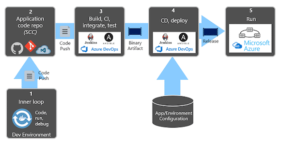

In the previous figure, pay special attention to separation of tasks.

The developer constructs a feature in their development environment, iterating through what is called the "inner loop" of code, run, and debug. When complete, that code is *pushed* into a code repository, such as GitHub, Azure DevOps, or BitBucket.

The push triggers a build stage that transforms the code into a binary artifact. The work is implemented with a [Continuous Integration (CI)](https://martinfowler.com/articles/continuousIntegration.html) pipeline. It automatically builds, tests, and packages the application.

The release stage picks up the binary artifact, applies external application and environment configuration information, and produces an immutable release. The release is deployed to a specified environment. The work is implemented with a [Continuous Delivery(CD)](https://martinfowler.com/bliki/ContinuousDelivery.html) pipeline. Each release should be identifiable. You can say, "This deployment is running Release 2.1.1 of the application."

Finally, the released feature is run in the target execution environment. Releases are immutable meaning that any change must create a new release.

Applying these practices, organizations have radically evolved how they ship software. Many have moved from quarterly releases to on-demand updates. The goal is to catch problems early in the development cycle when they're less expensive to fix. The longer the duration between integrations, the more expensive problems become to resolve. With consistency in the integration process, teams can commit code changes more frequently, leading to better collaboration and software quality.

::: tip 更多Microsoft关于Cloud Native一些技术点的细节介绍，参考如下系列文章：

- [https://docs.microsoft.com/en-us/dotnet/architecture/cloud-native/](https://docs.microsoft.com/en-us/dotnet/architecture/cloud-native/)

:::

