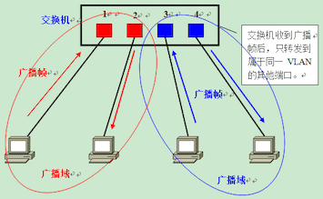

一些网络基础名词的介绍、解释

<!-- more -->

## 集线器、网桥、交换机、路由器

**集线器（Hub）：**

- only detects that a device is physically connected to it

> 主要功能是对接收到的信号进行再生整形放大，以扩大网络的传输距离；不具有类似于交换机的"智能记忆"能力和"学习"能力（不具有MAC地址表），所以它发送数据时都是没有针对性的，而是采用广播方式发送，也就是说当它要向某节点发送数据时，不是直接把数据发送到目的节点，而是把数据包发送到与集线器相连的所有节点。

**网桥（bridge）：**

网桥工作在数据链路层，起到的作用是把多个局域网连接起来，组成更大的局域网。它的功能主要有两点：过滤和转发。

通常来看，网桥起到了把不同局域网连接在一起的作用，即使这些局域网使用不同的协议比如802.11和802.3。加入一个网桥连接一个802.3和一个802.11，那么网桥转发的时候首先需要把802.3的帧头拆掉，换成802.11的头，再转发给802.11使之适应无线局域网的帧格式。

为什么会出现网桥？： *为了减少HUB的广播，提高局域网网络性能出现的。*我们都知道，之前也有关于集线器的介绍，像集线器这种工作在物理层的设备，根本不懂“帧”的概念，对于流入端口的数据会 进行简单的复制到相连的其他的端口，这样一来就缺乏了针对性，并且也给链路的通信造成了一定的负担，你们一定在读关于对集线器的介绍的时候会看到"广播"的字眼，正是因为集线器的这种”缺陷“，我们提出了”网桥“的概念。

网桥是怎么工作的？：大体就是，网桥内表（MAC-PortNum）会慢慢“学习”连接的两个子网的MAC地址，并将之对应到不同的端口。慢慢达到**智能**转发的效果，这样一来就缓解了集线器”广播“的缺陷。- 这里因为网桥涉及到MAC地址，所有并不是简单的跟电信号打交道，所以网桥工作在数据链路层。

**交换机（Switch）：**

- can detect specific devices that are connected to it
- Keeps a record of **MAC addresses** of those devices

*集线器和交换机的区别*

|          | 交换机         | 集线器   |
| -------- | -------------- | :------- |
| 工作层次 | 数据链路层     | 物理层   |
| 宽带影响 | 独享           | 共享     |
| 数据传输 | 有目的发送     | 广播发送 |
| 传输模式 | 全双工或半双工 | 半双工   |

> 具体解释： 
>
> - 数据传输：集线器工作的时候，如果局域网中的一台电脑要发送消息，则局域网内的所有电脑都可以接收到这个消息，安全性较差，而且每一次只能有一个发送，只有这个发送完毕其他电脑才能再发送，这称为半双工模式。而交换机有“记忆功能”，它能根据相应的MAC地址直接有目的的发送到目标电脑。但是如果向一台新的电脑发送消息，那么传输方式也将是广播，只有找到这台电脑， 并记住它的MAC地址后，以后才能直接发送给它。通过交换机连接的电脑可以同时发送消息互不影响，就像我们平时打电话一样，这称为全双工模式，传输速率比集线器大大提高。 
> -  宽带占用上：通过集线器，所有的电脑都共享一个宽带，如果宽带是100M，有5台电脑，则每台电脑只有20M；如果通过交换机，则所有的电脑都是100M。 
> - 通过比较可以发现，交换机与集线器相比有很大优势，所以现在基本上都用交换机，集线器已经渐渐被淘汰了。

**路由器（Router）：**

- routers data from one network to another based on their **IP address**
- the router is the gatewat of a network

**三者区别：**

- 集线器和交换机被使用在局域网中交换数据，而路由器用于广域网。
- 集线器和交换机用于创建网络，路由器用于连接网络。

*路由器和交换机的区别*

|          | 路由器         | 交换机             |
| -------- | -------------- | ------------------ |
| 工作层次 | 网络层         | 数据链路层         |
| 转发依据 | IP地址         | Mac地址            |
| 功能     | 连接不同的网络 | 连接局域网中的电脑 |
| 宽带影响 | 共享宽带       | 独享宽带           |

> 路由器是连接不同的网段的，负责将局域网连接到广域网和互联网中，并找到网络中数据传输最合适的路径。大家通过同一个路由器上网共用一个宽带，上网要相互影响。 
>
> 简单的说路由器专管入网，交换机只管配送，路由就是给你找路让你上网的，交换机只负责开门，交换机上面要没有路由你是上不了网的。

## 局域网技术

::: tip 转载

- [https://blog.csdn.net/ilovestudy_/article/details/104972532](https://blog.csdn.net/ilovestudy_/article/details/104972532)

:::

### 局域网概念

1. **根据网络规模分类**：

- 广域网
  - 覆盖范围大，传输距离远，传输率低，误码率高。
- 城域网
  - 覆盖范围介于局域网和广域网之间，几公里到几十公里。
- 局域网
  - 局部区域范围内的计算机网络。
  - 范围：几米至几公里，一个或相邻的建筑物内。
  - 特点：覆盖范围小，传输速率高，误码率低。
  - 应用：多用于单位内部网络建设。

2. **局域网中常用的拓扑结构**：

- **总线型**
- **星型**
- **环形**

3. 局域网本身是一种**通信网络**，只涉及到 OSI 参考模型中的数据链路层和物理层，不涉及高层内容。

4. IEEE 的 802 委员会将局域网分为两个子层：

- **MAC 子层**：与接入到传输媒体有关的内容都放在 MAC 子层。主要用来**解决多个结点如何使用共享介质的问题**。
- **LLC 子层**：与媒体接入无关的部分都集中在 LLC。其主要功能是**数据链路的建立和释放**、**LLC 帧的封装和拆卸**、**差错控制**、**提供与高层的接口**等。

### 物理地址（MAC）

- 在局域网中，硬件地址又称为物理地址，或 MAC 地址，是在数据链路层使用的地址。MAC地址共 48 比特，6 字节。前三个字节代表的是生产厂商的编号，后三个字节代表的是网卡的编号。
- MAC 地址通常表示为 12 个 16 进制数，每两个 16 进制数之间用冒号隔开。
- 数据链路层中数据是以数据帧（frame）为单位进行传输的。封装成帧就是在一段数据的前后分别添加首部和尾部，然后就构成了一个帧，确定了帧的界限。
- 数据帧首部中的源地址和目的地址就是用 MAC 地址来表示的。

 

- 发送数据帧时，**帧首部**写入目的主机的 MAC 地址。
- 收到数据帧后，首先检查帧首部的目的 MAC 地址，如果是发给自己的，就接收数据帧，否则就丢弃。

### CSMA / CD 协议

- 目前局域网采用的最通用的通信协议是**以太网（Ethernet）技术**。
- 最初的以太网是一个**总线型的网络**，任何一个主机发出的信号，都能被网络中其他所有的主机收到。(**目前主要演变成了星型结构**)
- 以太网需要解决的问题：
  - **寻址问题**：如何在广播式的网络完成一对一通信（**MAC 地址**）。
  - **冲突问题**：两台主机同时使用网络会发生冲突（**CSMA / CD 协议**）。
- 以太网使用**载波监听多路访问 / 冲突检测协议（CSMA / CD）**来解决总线使用权的问题，处理网络中产生的冲突问题：
  - **多路访问**：网络中的每个节点都能访问总线，通过总线发送数据。
  - **载波侦听**：在发送数据前，节点需要先 “听” 一下总线上是否有数据信号。如果检测到有数据信号，节点便等待直到总线空闲。如果 “听” 到总线没有数据信号，那么节点就将数据帧发送出去。
  - **冲突检测**：在发送数据帧的同时，还需要继续监听总线，检测是否发生了冲突。如果检测到了冲突，就马上停止数据发送。等待一个随机的时间后，再次重发。
- 冲突带来的问题：
  - 碰撞的结构是两个帧都变得无用（冲突使得信号相互叠加，使得原来的信号被破坏），而且这些无用的数据浪费了网络资源。
  - 节点在检测到冲突的时候，就马上停止数据发送。但是之前已经发出的数据还是会被接收方收到，而且是不完整的数据。所以接收方需要知道是否曾经发生冲突，收到的数据是否完整。
- 争用期（解决不完整数据问题）：
  - 从开始发送数据，到检测到冲突，这段时间是不确定的，它的最大值称为争用期。如果在争用期内没有检测到冲突，以后也不会有冲突产生了。
  - 在以太网中，**争用期 = 2 × 纵线长度 / 信号的传播速度**。
- 最短帧长（解决不完整数据问题）：
  - 以太网取 **51.2 μs** 为争用期的长度。对于 10 Mb/s 以太网，在争用期内可发送 512 bit，即 64 字节。以太网在发送数据时，若前 64 字节没有发生冲突，则后续的数据就不会发生冲突。
  - （10 Mb / s × 51.2 μs = 512 bit）
  - 以太网规定了最短有效帧长为 64 字节，凡长度小于 64 字节的帧都是由于冲突而异常终止的无效帧。

## 以太网

::: tip 转载

- [https://blog.csdn.net/xiangyuenacha/article/details/83616769](https://blog.csdn.net/xiangyuenacha/article/details/83616769)
- Others ...

:::

### 以太网简介与技术特性

> 如上所述**以太网（Ethernet）技术**是目前局域网采用的最通用的通信协议

以太网是一种计算机局域网技术。IEEE 802.3标准制定了以太网的技术标准，规定包括物理层的连线、电子信号和介质访问层协议的内容。以太网是目前应用最普遍的局域网技术，取代其他局域网技术如令牌环、FDDI和ARCNET

以太网是现实世界中最普遍的一种计算机网络。以太网有两类： 第一类是**经典以太网**。 第二类是**交换式以太网**，使用了一种称为交换机的设备连接不同的计算机。 经典以太网是以太网的原始形式，运行速度从 3~10 Mbps 不等；而交换式以太网正是广泛应用的以太网，可运行在 100、1000 和 10000Mbps 那样的高速率，分别以快速以太网、千兆以太网和万兆以太网的形式呈现。

以太网的标准拓扑结构为**总线型拓扑**，但目前的快速以太网（100BASE-T、1000BASE-T 标准）为了减少冲突，将能提高的网络速度和使用效率最大化，使用集线器来进行网络连接和组织。如此一来，以太网的拓扑结构就成了**星型**； **但在逻辑上，以太网仍然使用总线型拓扑和 CSMA/CD（Carrier Sense Multiple Access/Collision Detection，即载波多重访问/碰撞侦测）的总线技术**。

以太网实现了网络上无线电系统多个节点发送信息的想法，每个节点必须获取电缆或者信道的才能传送信息，有时也叫作以太（Ether）。（这个名字来源于 19 世纪的物理学家假设的电磁辐射媒体-光以太。后来的研究证明光以太不存在。） 每一个节点有全球唯一的 48 位地址也就是制造商分配给网卡的 MAC 地址，以保证以太网上所有节点能互相鉴别。由于以太网十分普遍，许多制造商把以太网卡直接集成进计算机主板。

### **以太网常用带宽**

- 10Mb/s以太网
- 100Mb/s以太网
- 1000Mb/s以太网
- 万兆以太网
  - 2002年6月，IEEE 802.3ae 10G以太网标准发布，以太网的发展势头又得到了一次增强。确定万兆以太网标准的目的是，将802.3协议扩展到10Gbps的工作速度，并扩展以太网的应用空间，使之能够包括WAN链接。
  - 万兆以太网在技术和性能方面有了其实质性的提高，也正因如此，以太网正在从局域网逐步延伸至城域网和广域网，在更广阔的范围内发挥其作用。

### 无线局域网

- 无线局域网（Wireless Local Area Network，缩写为“WLAN”），即采用无线传输媒体的进行通信的局域网。
  - 1、无线局域网标准：1997年6月，IEEE推出了第一代无线局域网标准——IEEE802.11
  - 2、无线局域网的传输媒体：无线局域网的数据传输媒体主要包括无线电波和红外线。
  - 3、无线局域网的拓扑：
    - （1）无中心拓扑
    - （2）有中心拓扑
  - 4、无线局域网的组网设备
    - （1）无线接入点（Access Point，AP）
    - （2）无线网卡（Wireless LAN Card）
    - （3）天线（Antenna）

### 局域网传输介质

1. **同轴电缆（Coaxial cable）**

   同轴电缆：同轴电缆曾今是局域网中使用最普通的一种线缆，它的典型特点是传输距离长，抗干扰性强。同轴电缆主要用于总线型网络中，它的结构和闭路电视的传输电缆很相似，只不过在性能和参数上有很大不同。

   同轴电缆的分类：

   - 细揽：细同轴电缆的直径为0.25英寸，它的最大传输距离为185米。如果超过此距离必须添加中继器放大信号，延长传输距离。细同轴电缆的传输速率为10M。
   - 组缆：粗同轴电缆的直径为0.5英寸，最大传输距离为500米。同样，若超过此距离时必须添加中继器放大信号，延长传输距离。粗同轴电缆的传输速率也为10M。

2. **双绞线（Twisted-pair）**

   双绞线：双绞线由相互绞合在一起的线对组成，如图所示。为制作网线时便于区分，每条线都标有不同的颜色。由于基于双绞线的星形拓扑比总线拓扑更容易维护，所以双绞线称为目前组建局域网最常用的一种线缆。

   双绞线的分类：

   - 屏蔽双绞线（STP）
   - 非屏蔽双绞线（UTP）
     - UTP双绞线的类型：
       - 1类 用于电话线和低速数据线
       - 2类 用于低速网络的电缆，4Mb/s
       - 3类 用于10Mb/s的以太网
       - 4类 用于距离更长且速度更高的网络，16Mb/s
       - 5类 用于高性能的数据通信，100Mb/s 
         超五类 传输速率155Mb/s

3. **光纤**

## 虚拟局域网（VLAN）

::: tip 转载参考

- [https://www.bilibili.com/video/BV1jt411S7Uu?from=search&seid=17231982611191769584](https://www.bilibili.com/video/BV1jt411S7Uu?from=search&seid=17231982611191769584)
- [http://www.xueyinonline.com/detail/208000882](http://www.xueyinonline.com/detail/208000882)
- [https://blog.csdn.net/liufuchun111/article/details/90710838](https://blog.csdn.net/liufuchun111/article/details/90710838)

:::

VLAN（Virtual Local Area Network）即虚拟局域网，是将一个物理的LAN在逻辑上划分成多个广播域的通信技术。VLAN内的主机间可以直接通信，而VLAN间不能直接互通，从而将广播报文限制在一个VLAN内。

### 以太网二层交换基础

以太网二层交换机的主要功能:

- 使得终端用户能够接入网络；
- 维护MAC地址表；
- 数据帧的转发及过滤；
- 二层环路避免及链路冗余性。

### 为什么需要VLAN

- 缺省时，整台交换机的所有端口均属于同一个广播域。当网络中的交换机数量特别多时，广播域将变得特别庞大，网络中可能充斥着大量广播。

> 偶尔少数的广播也许可以接受，但现实世界中，有大量频繁的广播需求。如：
>
> - TCP/IP协议栈中的很多协议都会使用广播：
>   - 地址解析协议ARP（已知IP地址，找出其相应的MAC地址）
>   - 路由信息协议RIP（一种小型的内部路由协议）
>   - 动态主机配置协议DHCP（用于自动配置IP地址）
> - NetBEUI：Windows下使用的广播协议
> - IPX/SPX：Novell网络的协议栈
> - Apple Talk：Apple公司的网络协议栈

- 同时，有时候物理局域网无法根据业务需求灵活的规划网络逻辑单元，VLAN可根据业务需求灵活的进行规划。

分割广播域的方法：

- 使用路由器可以隔离广播域
  - 成本较高
  - 有时不够灵活
- 虚拟局域网VLAN技术应运而生
  - VLAN是一种将局域网内的设备划分成与物理位置无关的逻辑组的技术，这些逻辑组具有某些共同的需求。

### **实现VLAN的机制**

在理解了“为什么需要VLAN”之后，接下来让我们来了解一下交换机是如何使用VLAN分割广播域的。

首先，在一台未设置任何VLAN的二层交换机上，任何广播帧都会被转发给除接收端口外的所有其他端口（Flooding）。例如，计算机A发送广播信息后，会被转发给端口2、3、4。 这时，如果在交换机上生成红、蓝两个VLAN；同时设置端口1、2属于红色VLAN、端口3、4属于蓝色VLAN。再从A发出广播帧的话，交换机就**只会**把它转发给同属于一个VLAN的其他端口——也就是同属于红色VLAN的端口2，**不会**再转发给属于蓝色VLAN的端口。 同样，C发送广播信息时，只会被转发给其他属于蓝色VLAN的端口，不会被转发给属于红色VLAN的端口。

就这样，VLAN通过**限制**广播帧转发的范围**分割**了广播域。上图中为了便于说明，以红、蓝两色识别不同的VLAN，在实际使用中则是用“**VLAN ID**”来区分的。

*但是，VLAN生成的**逻辑**上的交换机是**互不相通**的。因此，在交换机上设置VLAN后，如果未做其他处理，VLAN间是无法通信的。明明接在同一台交换机上，但却偏偏无法通信——这个事实也许让人难以接受。但它既是VLAN方便易用的特征，又是使VLAN令人难以理解的原因。*

#### **需要VLAN间通信时怎么办**

那么，当我们需要在不同的VLAN间通信时又该如何是好呢？

请大家再次回忆一下：VLAN是广播域。而通常两个广播域之间由路由器连接，广播域之间来往的数据包都是由**路由器中继**的。因此，VLAN间的通信也需要路由器提供中继服务，这被称作“**VLAN间路由**”。 VLAN间路由，**可以使用普通的路由器，也可以使用三层交换机**。所以不同VLAN间互相通信时需要用到路由功能。

### 交换机的端口种类（Access Link、Trunk Link）

1. 访问链接（Access Link）
2. 汇聚链接（Trunk Link）

两种链接的具体细节，查看参考文章：[https://blog.csdn.net/liufuchun111/article/details/90710838](https://blog.csdn.net/liufuchun111/article/details/90710838)

### **VLAN间路由**

### **三层交换机**

### **加速VLAN间通信的手段**

### **传统型路由器存在的意义**

### **使用VLAN设计局域网**

以上多个章节的具体详情，都请查看参考文章：[VLAN原理详解](https://blog.csdn.net/liufuchun111/article/details/90710838)

## 网卡

::: tip 转载

- [https://blog.csdn.net/tao546377318/article/details/51602298](https://blog.csdn.net/tao546377318/article/details/51602298)

:::

#### **认识网卡**

网卡(Network Interface Card，简称NIC)，也称网络适配器，是**电脑与局域网相互连接**的设备。无论是普通电脑还是高端服务器，只要连接到**局域网**，就都需要安装一块网卡。如果有必要，一台电脑也可以同时安装两块或多块网卡。

一块网卡包括OSI 模型的两个层， **物理层和数据链路层**：

- 物理层定义了数据传送与接收所需要的电与光信号、线路状态、时钟基准、数据编码和电路等，并向数据链路层设备提供标准接口。
- 数据链路层则提供寻址机构、数据帧的构建、数据差错检查、传送控制、向网络层 提供标准的数据接口等功能。

#### **网卡的组要作用**

网卡的功能主要有两个:

- 一是将电脑的数据封装为帧，并通过网线(对无线网络来说就是电磁波)将数据发送到网络上去。
- 二是接收网络上其它设备传过来的帧，并将帧重新组合成数据，发送到所在的电脑中。

网卡能接收所有在网络上传输的信号，但正常情况下只接受发送到该电脑的帧和广播帧，将其余的帧丢弃。然后，传送到系统CPU做进一步处理。当电脑发送数据时，网卡等待合适的时间将分组插入到数据流中。接收系统通知电脑消息是否完整地到达，如果出现问题，将要求对方重新发送。

#### 网卡的组成

以最常见的PCI接口的网卡为例

网卡的组成：

- 1）主芯片： 网卡的主控制芯片是网卡的核心元件，一块网卡性能的好坏和功能的强弱多寡，主要就是看这块芯片的质量。
- 2）BOOTROM槽：BOOTROM 插座也就是常说的无盘启动ROM 接口，其是用来通过远程启动服务构造无盘工作站的。
- 3）数据泵：作用一是传输数据；二是隔离网线连接的不同网络设备间的不同电平，还能对设备起到一定的防雷保护作用。
- 4）晶振即石英振荡器，提供基准频率。
- 5）LED指示灯：用来标识网卡的不同工作状态，例如，Link/Act表示连接活动状态，Full表示是否全双工，而Power是电源指示。
- 6）网线接口：有BNC接口和RJ-45接口，目前主要使用8芯线的RJ-45接口。
- 7）总线接口：用于网卡与电脑相连接，内置式网卡需要通过俗称“金手指”的总线接口插在计算机主板的扩展槽中。主要有ISA,PCI,PCMCIA和USB等常见的是PCI总线接口的网卡。

#### **网卡的工作原理**

- 网卡充当计算机和网络缆线之间的物理接口或连线，负责将计算机中的数字信号转换成电或光信号。
- 网卡要承担串行数据或并行数据间的转换，数据在计算机总线中并行传输，而在网络的物理缆线中以串行的比特流传输。

以太网卡中数据链路层的芯片一般简称之为 **MAC 控制器**，物理层的芯片我们简称之为**PHY**。许多网卡的芯片把MAC和PHY的功能做到了一颗芯片中，比如Intel 82559网卡和3COM 3C905网卡。但是MAC和PHY的机制还是单独存在的，只是外观的表现形式是一颗单芯片。当然也有很多网卡的MAC和PHY是分开做的，比如D-LINK的DFE-530TX等。

**1 数据链路层MAC 控制器**

首先我们来说说以太网卡的 MAC 芯片的功能。以太网数据链路层其实包含MAC（介质访问控制）子层和LLC（逻辑链路控制）子层。一块以太网卡MAC 芯片的作用不但要实 现MAC 子层和LLC 子层的功能，还要提供符合规范的PCI 界面以实现和主机的数据交换。 MAC 从PCI 总线收到IP 数据包（或者其他网络层协议的数据包）后，将之拆分并重 新打包成最大1518Byte，最小64Byte 的帧。这个帧里面包括了目标MAC 地址、自己的源 MAC 地址和数据包里面的协议类型（比如IP 数据包的类型用80 表示）。最后还有一个 DWORD(4Byte)的CRC 码。 可是目标的 MAC 地址是哪里来的呢？这牵扯到一个ARP 协议（介乎于网络层和数据链路层的一个协议）。第一次传送某个目的IP 地址的数据的时候，先会发出一个ARP 包，其MAC 的目标地址是广播地址，里面说到："谁是xxx.xxx.xxx.xxx 这个IP地址的主人？" 因为是广播包，所有这个局域网的主机都收到了这个ARP 请求。收到请求的主机将这个IP 地址和自己的相比较，如果不相同就不予理会，如果相同就发出ARP 响应包。这个IP 地址的主机收到这个ARP 请求包后回复的ARP 响应里说到："我是这个IP 地址的主人"。这个包里面就包括了他的MAC 地址。以后的给这个IP 地址的帧的目标MAC 地址就被确定了。（其它的协议如IPX/SPX 也有相应的协议完成这些操作。） IP 地址和MAC 地址之间的关联关系保存在主机系统里面，叫做ARP 表，由驱动程序和操作系统完成。在Microsoft 的系统里面可以用 arp -a 的命令查看ARP 表。收到数据帧的时候也是一样，做完CRC 以后，如果没有CRC 效验错误，就把帧头去掉，把数据包拿出来通过标准的借口传递给驱动和上层的协议客栈，最终正确的达到我们的应用程序。 还有一些控制帧，例如流控帧也需要MAC 直接识别并执行相应的行为。以太网MAC 芯片的一端接计算机PCI 总线，另外一端就接到PHY 芯片上。以太网的物理层又包括 MII/GMII（介质独立接口）子层、PCS（物理编码子层）、PMA（物理介质附加）子层、PMD （物理介质相关）子层、MDI 子层。而PHY 芯片是实现物理层的重要功能器件之一，实现了前面物理层的所有的子层的功能。

**2 物理层PHY**

PHY 在发送数据的时候，收到MAC 过来的数据（对PHY 来说，没有帧的概念，对它 来说，都是数据而不管什么地址，数据还是CRC），每4bit 就增加1bit 的检错码，然后把并 行数据转化为串行流数据，再按照物理层的编码规则（10Based-T 的NRZ 编码或100based-T 的曼彻斯特编码）把数据编码，再变为模拟信号把数据送出去。（注：关于网线上数据是数 字的还是模拟的比较不容易理解清楚。最后我再说） 收数据时的流程反之。 发送数据时，PHY 还有个重要的功能就是实现CSMA/CD 的部分功能，它可以检测到网络上是否有数据在传送。网卡首先侦听介质上是否有载波（载波由电压指示），如果有， 则认为其他站点正在传送信息，继续侦听介质。一旦通信介质在一定时间段内（称为帧间缝 隙IFG= 9.6 微秒）是安静的，即没有被其他站点占用，则开始进行帧数据发送，同时继续侦听通信介质，以检测冲突。在发送数据期间，如果检测到冲突，则立即停止该次发送，并 向介质发送一个“阻塞”信号，告知其他站点已经发生冲突，从而丢弃那些可能一直在接收的受到损坏的帧数据，并等待一段随机时间（CSMA/CD 确定等待时间的算法是二进制指数退 避算法）。在等待一段随机时间后，再进行新的发送。如果重传多次后（大于16 次）仍发生 冲突，就放弃发送。 接收时，网卡浏览介质上传输的每个帧，如果其长度小于64 字节，则认为是冲突碎片。 如果接收到的帧不是冲突碎片且目的地址是本地地址，则对帧进行完整性校验，如果帧长度 大于1518 字节（称为超长帧，可能由错误的LAN 驱动程序或干扰造成）或未能通过CRC 校验，则认为该帧发生了畸变。通过校验的帧被认为是有效的，网卡将它接收下来进行本地 处理 许多网友在接入 Internt 宽带时，喜欢使用"抢线"强的网卡，就是因为不同的PHY 碰撞 后计算随机时间的方法设计上不同，使得有些网卡比较"占便宜"。不过，抢线只对广播域的网络而言的，对于交换网络和ADSL 这样点到点连接到局端设备的接入方式没什么意义。 而且"抢线"也只是相对而言的，不会有质的变化。

**3 关于网络间的冲突**

现在交换机的普及使得交换网络的普及，使得冲突域网络少了很多，极大地提高了网络的带宽。但是如果用HUB，或者共享带宽接入Internet 的时候还是属于冲突域网络，有冲突碰撞的。交换机和HUB 最大的区别就是：一个是构建点到点网络的局域网交换设备，一个是构建冲突域网络的局域网互连设备。 我们的 PHY 还提供了和对端设备连接的重要功能并通过LED 灯显示出自己目前的连接的状态和工作状态让我们知道。当我们给网卡接入网线的时候，PHY 不断发出的脉冲信 号检测到对端有设备，它们通过标准的"语言"交流，互相协商并却定连接速度、双工模式、 是否采用流控等。 通常情况下，协商的结果是两个设备中能同时支持的最大速度和最好的双工模式。这 个技术被称为Auto Negotiation 或者NWAY，它们是一个意思--自动协商。

**4 PHY 的输出部分**

现在来了解 PHY 的输出后面部分。一颗CMOS 制程的芯片工作的时候产生的信号电平总是大于0V 的（这取决于芯片的制程和设计需求），但是这样的信号送到100 米甚至更长的地方会有很大的直流分量的损失。而且如果外部网现直接和芯片相连的话，电磁感应（打 雷）和静电，很容易造成芯片的损坏。 再就是设备接地方法不同，电网环境不同会导致双方的0V 电平不一致，这样信号从A 传到B，由于A 设备的0V 电平和B 点的0V 电平不一样，这样会导致很大的电流从电势高 的设备流向电势低的设备。我们如何解决这个问题呢？ 这时就出现了 Transformer（隔离变压器）这个器件。它把PHY 送出来的差分信号用差模耦合的线圈耦合滤波以增强信号，并且通过电磁场的转换耦合到连接网线的另外一端。这样不但使网线和PHY 之间没有物理上的连接而换传递了信号，隔断了信号中的直流分量， 还可以在不同0V 电平的设备中传送数据。 隔离变压器本身就是设计为耐 2KV~3KV 的电压的。也起到了防雷感应（我个人认为这里用防雷击不合适）保护的作用。有些朋友的网络设备在雷雨天气时容易被烧坏，大都是 PCB 设计不合理造成的，而且大都烧毁了设备的接口，很少有芯片被烧毁的，就是隔离变压器起到了保护作用。

**5 关于传输介质**

隔离变压器本身是个被动元件，只是把PHY 的信号耦合了到网线上，并没有起到功率放大的作用。那么一张网卡信号的传输的最长距离是谁决定的呢？ 一张网卡的传输最大距离和与对端设备连接的兼容性主要是 PHY 决定的。但是可以将信号送的超过100 米的PHY 其输出的功率也比较大，更容易产生EMI 的问题。这时候就需 要合适的Transformer 与之配合。作PHY 的老大公司Marvell 的PHY，常常可以传送180~200 米的距离，远远超过IEEE 的100 米的标准。 RJ-45 的接头实现了网卡和网线的连接。它里面有8 个铜片可以和网线中的4 对双绞（8 根）线对应连接。其中100M 的网络中1、2 是传送数据的，3、6 是接收数据的。1、2 之间

是一对差分信号，也就是说它们的波形一样，但是相位相差180 度，同一时刻的电压幅度互为正负。这样的信号可以传递的更远，抗干扰能力强。同样的，3、6 也一样是差分信号。 网线中的 8 根线，每两根扭在一起成为一对。我们制作网线的时候，一定要注意要让1、 2 在其中的一对，3、6 在一对。否则长距离情况下使用这根网线的时候会导致无法连接或连 接很不稳定。 现在新的 PHY 支持AUTO MDI-X 功能(也需要Transformer 支持)。它可以实现RJ-45 接口的1、2 上的传送信号线和3、6 上的接收信号线的功能自动互相交换。有的PHY 甚至 支持一对线中的正信号和负信号的功能自动交换。这样我们就不必为了到底连接某个设备需 要使用直通网线还是交叉网线而费心了。这项技术已经被广泛的应用在交换机和SOHO 路 由器上。在 1000Basd-T 网络中，其中最普遍的一种传输方式是使用网线中所有的4 对双绞线， 其中增加了4、5 和7、8 来共同传送接收数据。由于1000Based-T 网络的规范包含了AUTO MDI-X 功能，因此不能严格确定它们的传出或接收的关系，要看双方的具体的协商结果。

**6 PHY 和MAC 之间如何进行沟通**

下面继续让我们来关心一下 PHY 和MAC 之间是如何传送数据和相互沟通的。通过 IEEE 定义的标准的MII/GigaMII（Media Independed Interfade，介质独立界面）界面连接MAC 和PHY。这个界面是IEEE 定义的。MII 界面传递了网络的所有数据和数据的控制。 而 MAC 对PHY 的工作状态的确定和对PHY 的控制则是使用SMI（Serial ManagementInterface）界面通过读写PHY 的寄存器来完成的。PHY 里面的部分寄存器也是IEEE 定义的， 这样PHY 把自己的目前的状态反映到寄存器里面，MAC 通过SMI 总线不断的读取PHY 的 状态寄存器以得知目前PHY 的状态，例如连接速度，双工的能力等。当然也可以通过SMI 设置PHY 的寄存器达到控制的目的，例如流控的打开关闭，自协商模式还是强制模式等。 我们看到了，不论是物理连接的 MII 界面和SMI 总线还是PHY 的状态寄存器和控制寄存器都是有IEEE 的规范的，因此不同公司的MAC 和PHY 一样可以协调工作。当然为了配合不同公司的PHY 的自己特有的一些功能，驱动需要做相应的修改。

**7 网卡的供电**

最后就是电源部分了。大多数网卡现在都使用 3.3V 或更低的电压。有的是双电压的。 因此需要电源转换电路。 而且网卡为了实现 Wake on line 功能，必须保证全部的PHY 和MAC 的极少一部分始终处于有电的状态，这需要把主板上的5V Standby 电压转换为PHY 工作电压的电路。在主网桥机开机后，PHY 的工作电压应该被从5V 转出来的电压替代以节省5V Standby 的消耗。（许多劣质网卡没有这么做）。 有 Wake on line 功能的网卡一般还有一个WOL 的接口。那是因为PCI2.1 以前没有PCI 设备唤醒主机的功能，所以需要着一根线通过主板上的WOL 的接口连到南桥里面以实现 WOL 的功能。新的主板合网卡一般支持 PCI2.2/2.3，扩展了PME#信号功能，不需要那个接口而通过 PCI 总线就可以实现唤醒功能。

## NAT

::: tip 转载参考

- [https://blog.csdn.net/hzhsan/article/details/45038265](https://blog.csdn.net/hzhsan/article/details/45038265)
- [https://blog.csdn.net/gui951753/article/details/79593307](https://blog.csdn.net/gui951753/article/details/79593307)
- [https://blog.csdn.net/qq_45877524/article/details/105237657](https://blog.csdn.net/qq_45877524/article/details/105237657)

:::

### **NAT产生背景**

今天，无数快乐的互联网用户在尽情享受Internet带来的乐趣。他们浏览新闻，搜索资料，下载软件，广交新朋，分享信息，甚至于足不出户获取一切日用所需。企业利用互联网发布信息，传递资料和订单，提供技术支持，完成日常办公。然而，Internet在给亿万用户带来便利的同时，自身却面临一个致命的问题：构建这个无所不能的Internet的基础IPv4协议已经不能再提供新的网络地址了。

2011年2月3日中国农历新年， IANA对外宣布：IPv4地址空间最后5个地址块已经被分配给下属的5个地区委员会。2011年4月15日，亚太区委员会APNIC对外宣布，除了个别保留地址外，本区域所有的IPv4地址基本耗尽。一时之间，IPv4地址作为一种濒危资源身价陡增，各大网络公司出巨资收购剩余的空闲地址。其实，IPv4地址不足问题已不是新问题，早在20年以前，IPv4地址即将耗尽的问题就已经摆在Internet先驱们面前。这不禁让我们想去了解，是什么技术使这一危机延缓了尽20年。

要找到问题的答案，让我们先来简略回顾一下IPv4协议。

IPv4即网际网协议第4版——Internet Protocol Version 4的缩写。IPv4定义一个跨越异种网络互连的超级网，它为每个网际网的节点分配全球唯一IP地址。如果我们把Internet比作一个邮政系统，那么IP地址的作用就等同于包含城市、街区、门牌编号在内的完整地址。IPv4使用32bits整数表达一个地址，地址最大范围就是232 约为43亿。以IP创始时期可被联网的设备来看，这样的一个空间已经很大，很难被短时间用完。然而，事实远远超出人们的设想，计算机网络在此后的几十年里迅速壮大，网络终端数量呈爆炸性增长。

更为糟糕的是，为了路由和管理方便，43亿的地址空间被按照不同前缀长度划分为A,B,C,D类地址网络和保留地址。其中，A类网络地址127段，每段包括主机地址约1678万个。B类网络地址16384段，每段包括65536个主机地址。 
ANA向超大型企业/组织分配A类网络地址，一次一段。向中型企业或教育机构分配B类网络地址，一次一段。这样一种分配策略使得IP地址浪费很严重，很多被分配出去的地址没有真实被利用，地址消耗很快。以至于二十世纪90年代初，网络专家们意识到，这样大手大脚下去，IPv4地址很快就要耗光了。于是，人们开始考虑IPv4的替代方案，同时采取一系列的措施来减缓IPv4地址的消耗。正是在这样一个背景之下，本期的主角闪亮登场，它就是网络地址转换——NAT。

NAT是一项神奇的技术，说它神奇在于它的出现几乎使IPv4起死回生。在IPv4已经被认为行将结束历史使命之后近20年时间里，人们几乎忘了IPv4的地址空间即将耗尽这样一个事实——在新技术日新月异的时代，20年可算一段漫长的历史。更不用说，在NAT产生以后，网络终端的数量呈加速上升趋势，对IP地址的需求剧烈增加。此足见NAT技术之成功，影响之深远。

说它神奇，更因为NAT给IP网络模型带来了深远影响，其身影遍布网络每个角落。根据一份最近的研究报告，70%的P2P用户位于NAT网关以内。因为P2P主要运行在终端用户的个人电脑之上，这个数字意味着大多数PC通过NAT网关连接到Internet。如果加上2G和3G方式联网的智能手机等移动终端，在NAT网关之后的用户远远超过这个比例。

### **NAT技术的工作原理和特点**

> 同学你现在做两个操作
>
> - 打开你的命令行输入ipconfig查询你的Ip地址
> - 打开百度，输入Ip查询，查询你的ip地址
>
> **你是不是发现了一件很神奇的事情，这两个地址是不一样的。但是我们又经常说每个主机只有一个ip,这个ip是他的身份标识。这完全矛盾啊。这就引出了我们今天要讲的NAT技术** 
> 其实并不矛盾。这里我们要引入公网ip和私网ip这两个概念，关于这个问题的解读。大家可以参看我的博文。为什么百度查到的ip和ipconfig查到的不一样?

NAT名字很准确，网络地址转换，就是替换IP报文头部的地址信息。NAT通常部署在一个组织的网络出口位置，通过将内部网络IP地址替换为出口的IP地址提供公网可达性和上层协议的连接能力。那么，什么是内部网络IP地址？

RFC1918规定了三个保留地址段落：10.0.0.0-10.255.255.255；172.16.0.0-172.31.255.255；192.168.0.0-192.168.255.255。这三个范围分别处于A,B,C类的地址段，不向特定的用户分配，被IANA作为私有地址保留。这些地址可以在任何组织或企业内部使用，和其他Internet地址的区别就是，仅能在内部使用，不能作为全球路由地址。这就是说，出了组织的管理范围这些地址就不再有意义，无论是作为源地址，还是目的地址。对于一个封闭的组织，如果其网络不连接到Internet，就可以使用这些地址而不用向IANA提出申请，而在内部的路由管理和报文传递方式与其他网络没有差异。

对于有Internet访问需求而内部又使用私有地址的网络，就要在组织的出口位置部署NAT网关，在报文离开私网进入Internet时，将源IP替换为公网地址，通常是出口设备的接口地址。一个对外的访问请求在到达目标以后，表现为由本组织出口设备发起，因此被请求的服务端可将响应由Internet发回出口网关。出口网关再将目的地址替换为私网的源主机地址，发回内部。这样一次由私网主机向公网服务端的请求和响应就在通信两端均无感知的情况下完成了。依据这种模型，数量庞大的内网主机就不再需要公有IP地址了

**我们一般使用私网ip作为局域网内部的主机标识，使用公网ip作为互联网上通信的标识**  
在整个NAT的转换中，最关键的流程有以下几点

- 网络被分为私网和公网两个部分，NAT网关设置在私网到公网的路由出口位置，双向流量必须都要经过NAT网关
- **网络访问只能先由私网侧发起，公网无法主动访问私网主机；**
- NAT网关在两个访问方向上完成两次地址的转换或翻译，出方向做源信息替换，入方向做目的信息替换；
- NAT网关的存在对通信双方是保持透明的；
- NAT网关为了实现双向翻译的功能，需要维护一张关联表，把会话的信息保存下来。

### NAT分类

NAT有三种类型：静态NAT(Static NAT)、动态地址NAT(Pooled NAT)、网络地址端口转换NAPT（Port-Level NAT）。

**NAPT**

其中，网络地址端口转换NAPT（Network Address Port Translation）则是把内部地址映射到外部网络的一个IP地址的不同端口上。它可以将中小型的网络隐藏在一个合法的IP地址后面。

NAPT是使用最普遍的一种转换方式，在HomeGW中也主要使用该方式。它又包含两种转换方式：SNAT和DNAT。

- (1)源NAT（Source NAT，SNAT）：修改数据包的源地址。源NAT改变第一个数据包的来源地址，它永远会在数据包发送到网络之前完成，数据包伪装就是一具SNAT的例子。
- (2)目的NAT（Destination NAT，DNAT）：修改数据包的目的地址。Destination NAT刚好与SNAT相反，它是改变第一个数据懈的目的地地址，如平衡负载、端口转发和透明代理就是属于DNAT。

**静态NAT**

如果一个内部主机唯一占用一个公网IP，这种方式被称为一对一模型。此种方式下，转换上层协议就是不必要的，因为一个公网IP就能唯一对应一个内部主机。显然，这种方式对节约公网IP没有太大意义，主要是为了实现一些特殊的组网需求。比如用户希望隐藏内部主机的真实IP，或者实现两个IP地址重叠网络的通信。

**动态NAT**

它能够将未注册的IP地址映射到注册IP地址池中的一个地址。不像使用静态NAT那样，你无需静态地配置路由器，使其将每个内部地址映射到一个外部地址，但必须有足够的公有因特网IP地址，让连接到因特网的主机都能够同时发送和接收分组。

### **NAT穿透技术**

具体可参考文章：[NAT技术详解（网络地址转换）](https://blog.csdn.net/qq_45877524/article/details/105237657)

## DHCP

::: tip 转载参考

- [http://blog.itpub.net/31442725/viewspace-2645914/](http://blog.itpub.net/31442725/viewspace-2645914/)

:::

### 什么是DHCP

DHCP，全称Dynamic Host configuration protocol，动态主机配置协议，前身是BOOTP协议，是一个局域网的网络协议，使用UDP协议工作，常用的2个端口：67(**DHCP server**)，68(**DHCP client**)。

它可以为客户机自动分配IP地址、子网掩码以及缺省网关、DNS服务器的IP地址等TCP/IP参数， 简单来说， 就是在DHCP服务器上有一个数据库， 存放着IP地址、网关、DNS等参数。 当客户端请求使用时， 服务器则负责将相应的参数分配个客户端，避免客户端手动指定IP地址等。特别是在一些大规模的网络中。客户端数目较多，使用DHCP可以方便对这些机器进行管理，为客户机提供TCP/IP参数配置，如IP地址、网关地址和DNS服务器等，不仅效率高，而且不存在IP地址冲突的情况现在的无线路由器默认都带有DHCP功能，也就是说一个无线路由器同时也是一个DHCP服务器。

### 工作原理简介

 

- **DHCP DISCOVER**: 寻找DHCP服务器  
  - 当DHCP客户端第一次登录网络的时候或者是开机的时候， 此设备发现本机上没有任何IP设定，就会网络广播去寻找DHCP服务器。网络上每一台安装了TCP/IP协议的主机都会接收到这种广播信息，但只有DHCP服务器才会做出响应。

- **DHCP OFFER**: 分配IP地址
  - 当 DHCP 服务器监听到客户端发出的 DHCP Discover 广播后， 会针对这个客户端的硬件地址 (MAC) 与本身的设定数据来进行下列工作：
    - 1.到服务器的登录文件中寻找该用户之前是否曾经用过某个 IP ，若有且该 IP 目前无人使用，则提供此 IP 给客户机；
    - 2.若配置文件针对该 MAC 提供额外的固定 IP (static IP) 时，则提供该固定 IP 给客户机；
    - 3.若不符合上述两个条件， 则随机取用目前没有被使用的 IP 参数给客户端，并记录下来。回应给客户端一个DHCP OFFER封包，由于客户端在开始的时候还没有IP地址﹐所以在其DHCP Discover封包内会带有其MAC地址信息﹐并且有一个XID编号来辨别该封包﹐DHCP服务器回应的DHCP Offer封包则会根据这些资料传递给要求租约的客户。根据服务器端的设定﹐DHCP Offer封包会包含一个租约期限的信息。但这里仅仅是分配， 客户端还没有真正的使用

- **DHCP REQUEST**: 请求使用
  - 如果客户端收到网路上多台DHCP服务器的回应﹐只会挑选其中一个DHCP Offer(通常是最先抵达的那个)并且向网路发送一个DHCP Request广播封包，告诉所有DHCP服务器它将指定接受哪一台服务器提供的IP位址。之所以要以广播方式回答，是为了通知所有的DHCP服务器，他将选择某台DHCP服务器所提供的IP地址， 同时，客户端还会发送一个ARP封包， 查询网路上有没有其他机器使用该IP地址， 如果发现该IP被占用， 客户端会发送一个DHCP Decline封包给DHCP服务器， 拒绝接受其DHCP Offer，并重新开始发送DHCP Discover信息。

- **DHCP ACK**: IP地址分配确认
  - 当DHCP服务器收到DHCP客户机回答的DHCP Request请求信息之后， 它便向DHCP客户机发送一个包含它所提供的IP地址和其他设置的DHCP Ack确认信息。以确认IP地址的正式生效。然后DHCP客户机便将其TCP/IP协议与网卡绑定，另外，除DHCP客户机选中的服务器外，其他的DHCP服务器都将收回之前提供的IP地址。

## SNMP 协议

::: tip 转载

- [https://www.cnblogs.com/longlogs/p/11988639.html](https://www.cnblogs.com/longlogs/p/11988639.html)

:::

### SNMP概念及背景

SNMP：“简单网络管理协议”，用于网络管理的协议。SNMP用于网络设备的管理。SNMP的工作方式：管理员需要向设备获取数据，所以SNMP提供了 “读”操作；管理员需要向设备执行设置操作，所以SNMP提供了“写”操作；设备需要在重要状况改变的时候，向管理员通报事件的发生，所以SNMP提供了 “Trap”操作。

**SNMP背景**

SNMP 的基本思想：为不同种类的设备、不同厂家生产的设备、不同型号的设备，定义为一个统一的接口和协议，使得管理员可以是使用统一的外观面对这些需要管理的网 络设备进行管理。通过网络，管理员可以管理位于不同物理空间的设备，从而大大提高网络管理的效率，简化网络管理员的工作。

### SNMP结构概述

NMP 被设计为工作在TCP/IP协议族上。SNMP基于TCP/IP协议工作，对网络中支持SNMP协议的设备进行管理。所有支持SNMP协议的设备都提供 SNMP这个统一界面，使得管理员可以使用统一的操作进行管理，而不必理会设备是什么类型、是哪个厂家生产的。如下图，

**SNMP支持的网管操作**

对于网络管理，我们面对的数据是设备的配置、参数、状态等信息，面对的操作是读取和设置；同时，因为网络设备众多，为了能及时得到设备的重要状态，还要求设备能主动地汇报重要状态，这就是报警功能。

- Get：读取网络设备的状态信息。
- Set：远程配置设备参数。
- Trap：管理站及时获取设备的重要信息。

### SNMP的实现结构

在具体实现上，SNMP为管理员提供了一个网管平台(NMS)，又称为管理站，负责网管命令的发出、数据存储、及数据分析。被监管的设备上运行一个SNMP代理(Agent))，代理实现设备与管理站的SNMP通信。如下图，

管理站与代理端通过MIB进行接口统一，MIB定义了设备中的被管理对象。管理站和代理都实现了相应的MIB对象，使得双方可以识别对方的数据，实现通信。管理站向代理申请MIB中定义的数据，代理识别后，将管理设备提供的相关状态或参数等数据转换为MIB定义的格式，应答给管理站，完成一次管理操作。

已有的设备，只要新加一个SNMP模块就可以实现网络支持。旧的带扩展槽的设备，只要插入SNMP模块插卡即可支持网络管理。网络上的许多设备，路由器、 换机等，都可以通过添加一个SNMP网管模块而增加网管功能。服务器可以通过运行一个网管进程实现。其他服务级的产品也可以通过网管模块实现网络管理，如 Oracle、WebLogic都有SNMP进程，运行后就可以通过管理站对这些系统级服务进行管理。

**根据管理者和被管理的设备在网络管理操作中的不同职责，SNMP定义了3种角色**。

- **网络管理系统**：又称管理站、**NMS**。是系统的控制台，向管理员提供界面以获取与改变设备的配置、信息、状态、操作等信息。管理站与Agent进行通信，执行相应的Set和Get操作，并接收代理发过来的警报(Trap)。
- **代理**：**Agent**是网络管理的代理人，负责管理站和设备SNMP操作的传递。介于管理站和设备之间，与管理站通信并相应管理站的请求，从设备获取相应的数 据，或对设备进行相应的设置，来响应管理站的请求。代理也需要具有根据设备的相应状态使用MIB中定义的Trap向管理站发送报告的能力。
- **代理服务器**：**Proxy**是一种特殊的代理，在不能直接使用SNMP协议的地方，如：异种网络、不同版本的SNMP代理等情况，Proxy代替相关设备向管理站提供一种外观，为设备代理SNMP协议的实现。Proxy做了异种网络或不同版本代理和相应SNMP数据请求的转换工作。

### SNMP的技术术语

- SNMP：Simple Network Management Protocol(简单网络管理协议)，是一个标准的用于管理基于IP网络上设备的协议。
- MIB：Management Information Base(管理信息库)，定义代理进程中所有可被查询和修改的参数。
- SMI：Structure of Management Information(管理信息结构)，SMI定义了SNMP中使用到的ASN.1类型、语法，并定义了SNMP中使用到的类型、宏、符号等。SMI用 于后续协议的描述和MIB的定义。每个版本的SNMP都可能定义自己的SMI。
- ASN.1：Abstract Syntax Notation One(抽象语法定义)。用于定义语法的正式语言，在SNMP中定义SNMP的协议数据单元PDU和管理对象MIB的格式。SNMP只使用了ASN.1中 的一部分，而且使用ASN.1的语言特性定义了一些自定义类型和类型宏 ，这些组成了SMI。
- PDU： Protocol Data Unit(协议数据单元)，它是网络中传送的数据包。每一种SNMP操作，物理上都对应一个PDU。
- NMS： Network Management System，网络管理系统，又名网络管理站，简称“管理站”。它是SNMP的总控机，提供统一的用户界面访问支持SNMP的设备，一般提供UI界面，并 有统计、分析等功能，是网管系统的总控制台。NMS是网络管理操作的发起者。
- Agent： 是SNMP的访问代理，简称“代理”，为设备提供SNMP能力，负责设备与NMS的通信。
- Proxy： 代理服务器，对实现不同协议的设备进行协议转换，使非IP协议的设备也能被管理。
- Trap： 是由设备主动发出的报警数据，用于提示重要的状态的改变。
- BER： Basic Encoding Rule，基本编码规格。描述如何将ASN.1类型的值编码为字符串的方法。它是ASN.1标准的一部分。BER编码将数据分成TLV三部分，T为Tag 的缩写，是类型标识；L为Length的缩写，标识类型的长度；V为Value的缩写，标识数据内容。按照TLV的顺序对数据进行编码，生成字节流。 SNMP使用BER将SNMP的操作请求和应答编码后进行传输，并用于接收端进行解码。

**ASN.1、BER、SMI、MIB、PDU的关系**

- ASN.1：高级的数据描述语言。描述数据的类型、结构、组织、及编码方法。包括符号和语法两部分。SNMP使用ASN.1描述PDU和管理学对象信息库MIB。
- BER：ASN.1 的基本编码规则。描述具体的ASN.1对象如何编码为比特流在网络上传输。SNMP使用BER作为编码方案，数据首先先经过BER编码，再经由传输层协议 (一边是UDP)发往接收方。接收方在SNMP端口上收到PDU后，经过BER解码后，得到具体的SNMP操作数据。
- SMI：是SNMP的描述方法。规定了使用ASN.1子类型、符号。ASN.1功能强大，但SNMP只用到了其中很小一部分，对于这一部分内容的描述，限定了范围，即为SMI。SMI规定了使用到的ASN.1类型、宏、符号等。SMI是ASN.1的一个子集和超集。
- MIB： 是SNMP中使用到的管理信息库。定义了数据格式、类型、顺序、意义等，使用SMI中定义的类型和ASN.1中的基本类型对对象进行描述，是一个使用 SMI描述的管理信息库。每一类关心的事件都有一组MIB，比如网络接口有一颗MIB树，TCP有一颗MIB树，UDP也有一颗MIB树。
- PDU：是SNMP的协议数据单元。PDU是基本的通信格式，使用ASN.1描述，使用BER编码，通过传输层协议传送。

### SNMP现有版本

SNMP共有v1，v2，v3这三个版本：

- v1和v2都具有基本的读、写MIB功能。
- v2增加了警报、批量数据获取、管理站和管理站通信能力。
- v3在v2的基础上增加了USM，使用加密的数据和用户验证技术，提高了安全性。
- 另外，RMON是SNMP的一个重要扩展，为SNMP增加了子网流量、统计、分析能力。现有两个版本： Rmon：提供了OSI七层网络结构中网络层和数据链路层监视能力。Rmon2：提供了OSI七层网络结构中网络层之上各层的监视能力。

## Telemetry (Streaming Telemetry)

::: tip 转载

- [https://www.sdnlab.com/23887.html](https://www.sdnlab.com/23887.html)

:::

### Telemetry是什么

遥测是什么？从字面意思看遥远的测量某个东西？还是不误导大众了，比较权威的说法是遥测是对被测量对象的参数进行远距离测量的一种技术，起源于19世纪初，广泛应用于航空航天、军事、工业、生物研究、医学等等方面。

比如发射卫星后，地面的卫星研究中心需要监测其运行状态，因为卫星的运行状态会受太阳光的压力和其它星球运动的影响而发生变化，这时候我们需要通过传感器去测量卫星的飞行速度、旋转速度、自旋轴的方向等等，然后靠高频的无线电波送回地面，进行分析。 同理，承载上面这些宏观业务（航天、工业、医学等）的网络本身也可以进行遥测，通过对网络设备的数据进行远程高速采集和监控，提供更实时、更全面和更精细的网络监管能力。

随着数据中心承载的业务越来越多，一方面数据中心网络快速演变，SDN、大二层Overlay、以及RDMA等技术快速落地应用，另外一方面数据中心需要管理的网络设备也越来越多，如何实现对数据中心全网实现端到端的流量管理与故障监控，甚至故障预判则越来越迫切。 传统的网络监控方案诸如CLI、SNMP和Syslog，都因各自的局限性不能满足云数据中心对于网络监控的要求。 因此，面对大规模、高性能、实时、全路径网络数据监控需求，SDN网络呼唤新的网络监控方式：**Telemetry**解决方案在此背景下，应运而生

### 深究Telemetry技术

Telemetry（遥测技术），一般是指从物理网元或者虚拟网元上远程实时高速采集数据，实现对网络实时、高速和更精细的监控技术。相比于传统的网络监控技术，如CLI、SNMP，Telemetry通过推模式，主动向采集器上推动数据信息，提供更实时更高速更精确的网络监控功能。

*我们先来看看一下Telemetry的模型结构，作为一个网络监控技术，Telemetry由网络设备和网管系统两大部分组成的。*

作为网络设备，Telemetry相当于原始数据模型，编码类型和传输协议的组合。对于网管系统，Telemetry就相当于收集系统存储系统和应用分析系统的组合。

在网络设备测，Telemetry按照样yang模型组织数据，用GPB(goole protocol buffer)格式编码，并通过加PC协议传输数据，使得数据的获取更高效，智能对接更便捷。而在网管系统测，Telemetry可以完成数据的收集存储和分析功能，利用分析结果可以为网络配置调整提供依据。

### Telemetry与传统网络监控方式对比

下面通过一些传统网络监控技术的对比，介绍一下Telemetry优势。

首先，传统监管方式，例如SNMP/CLI，使用了“网管查询到设备响应”的拉模式（PULL Mode）采集数据。一次查询都有一次响应，设备需要处理大量重复的查询。Telemetry采用了“网管定制-设备实时推送”的推模式采集数据。一次定制就可以对应多次响应，降低了设备处理查询报文的压力。

其次，传统网络监控方式通过拉模式获取数据。如果网络卡顿或者网络获取不及时，就容易造成数据失真。而Telemetry周期性的向网管系统推送数据，避免了网络延时造成的数据不准确。

第三，传统的网络监控方式如果要采集N台设备的数据，需要执行N次的查询操作。如果同时采集M的数据，则需要N*X操作。而采用Telemetry技术，所有的设备只需要提前配置订阅。各种数据实时上报，中间的过程无需人工操作。

针对以上做出总结：

Telemetry的工作模式是推模式，可以主动推送数据，精度是亚秒级。而且比较关键的一点是，Telemetry的数据结构采用采用标准结构和标准编码。方便对接第三方的设备，有助于网络监控的效率的提升和监控质量的提升。

### 其他知识点

- **传统的网络监控模式 - CLI、SNMP、Syslog ...**
- **Telemetry关键网络技术解析 - Telemetry方案网络技术一般主要涉及INT、gRPC、ERSPAN以及NetConf等**

> 具体参考原文 [网络自动化的奠基石：看“遥测”如何打败传统网络监控](https://www.sdnlab.com/23887.html) 或 其他相关文章

### 延伸阅读 

> 原文：[SNMP 已死 - Streaming Telemetry 流遥测技术](https://blog.51cto.com/gingerbeer/2287783)
>
> - SNMP监控缺点
>   - *具体参考原文*
> - 从拉（Pull） 到推（Push）的变化
>   - *具体参考原文*
>
>  
>
> - 未来趋势：Streaming Telemetry 流遥测技术
>
> 这个名字很吊，流遥测技术。
>
> 其实，简单来讲。它就是实现了上述“推”数据的方法。
>
> 那如何高效的完成“推”的这个动作呢？
>
> Streaming Telemetry有如下特点：
>
> **1.基于数据层面的数据上报**
>
> 传统的SNMP，不管是查询还是Trap，都是路由引擎，控制层面来处理。
>
> 但是Streaming Telemetry则可以借助于厂商支持，在硬件板卡ASIC层面植入代码，直接从板卡导出实时数据。
>
> 而板卡导出的数据是按照线速发送，从而使得上层的路由引擎专注于处理协议和路由计算等。
>
> 如下图所示：
>
> 
>
> **2.高扩展性**
>
> 基于第一条数据层面的原因，Stream Telemetry的扩展性大大增强。
>
> 例如下面这张图是一张CPU的利用率图。（设备型号未知）
>
> 大致看来，CPU利用率徘徊在8%左右。
>
> 
>
> 但是，这台设备配置了Stream Telemetry主动上报。
>
> 你猜，它都上报了多少内容？
>
> **下面是数据：**
>
> 1. 每15秒上报一次
> 2. 超过60种指标上报
> 3. 包含500多个上报类型
> 4. 176个万兆接口的输入，输出统计，error数，Qos队列数统计。
> 5. 每一个接口都包含IPv4和IPv6两种数据类型。
> 6. 最后以及200个MPLS LSP的字节数和数据包数。
>
> 太恐怖了，SNMP与之相比，瞬间弱爆了。
>
> 这一张图片红色线条，在上面提到过是某协议吐出的数据。
>
> 不用说，你都知道了。
>
> 这就是Streaming Telemetry吐出的数据。
>
> 
>
> **3.自动支持 Devops运维自动化**
>
> Streaming Telemetry因为两大优势，自动对接了当前流行的技术，例如运维自动化技术。
>
> 一方面，Streaming Telemetry监控平台收集到的数据接近于即时信息，所以Devops运维自动化工程师可以有很多不同的玩法，例如根据当前流量数据，结合SDN来自动调整数据转发路径。
>
> 另外一方面，Streaming Telemetry采用的数据格式都是当今很流行的标准格式和模型。例如JSON，NETCONF，以及YANG模型。
>
> 所以，简单来说，这是一个顺应时代的工具和技术。
>
> **4.多选择**
>
> 目前Streaming Telemetry技术，有两个选择。
>
> **一个是Sflow**
>
> **而另外一个是OpenConfig Telemetry**

## to be added ..

*继续添加 网络基础名词概念 >>>*

## Continue

[网络基础名词2 - SDN相关](/blogs/2020/1014-networkterm2.html)

