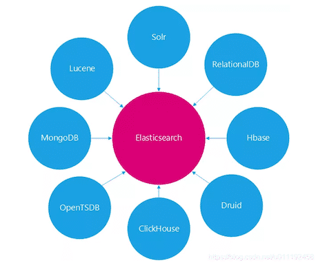
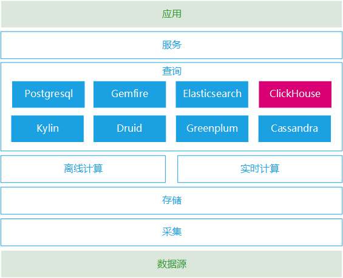
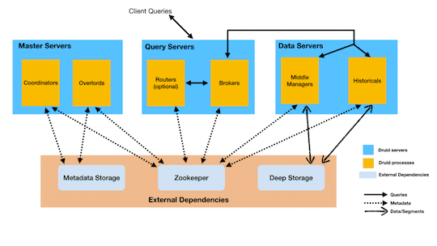

Elasticseach从做搜索引擎开始，到现在主攻大数据分析领域，逐步进化成了一个全能型的数据产品，在Elasticsearch诸多优秀的功能中，与很多数据产品有越来越多的交叉竞争，有的功能很有特色，有的功能只是附带，了解这些产品特点有助于更好的应用于业务需求。

<!-- more -->

## ES对比其他数据产品

::: tip 转载

- [https://blog.csdn.net/u011192458/article/details/105988278/](https://blog.csdn.net/u011192458/article/details/105988278/)

关于ES的具体技术专题，可查看"[技术专题博客](https://heyan.site:8001/index/)"相关文章

:::

对比产品：

### **Lucene**

Lucene是一个搜索的核心库，Elastic也是在Lucene基础之上构建，它们之间的竞争关系是由Lucene本身决定的。

在互联网2.0时代，考验各互联网公司最简单的技术要求，就是看他们的搜索做的怎么样，那时大家的做法几乎一样，都基于Lucene核心库构建一套搜索引擎，剩下的就看各公司的开发者们的水平。笔者有幸在2012年之前，基于Lucene做过垂直行业的搜索引擎，遇到很多问题有必要说一下：

- 项目基于Lucene包装，业务代码与核心库一起构建发布，代码耦合度很高，每次有数据字段变更，都需要重新编译打包发布，这个过程非常的繁琐，且相当危险。
- 程序重新发布，需要关闭原有的程序，涉及到进程切换问题。
- 索引数据定期全量重新生成，也涉及到新旧索引切换，索引实时刷新等问题，都需要设计一套复杂的程序机制保障
- 每个独立业务线需求，都需要单独构建一个Lucene索引进程，业务线多了之后，管理是个麻烦的事情
- 当单个Lucene索引数据超过单实例限制之后，需要做分布式，这个原有Lucene是没有办法的，所以常规的做法也是按照某特定分类，拆分成多个索引进程，客户端查询时带上特定分类，后端根据特定分类路由到具体的索引。
- Lucene库本身的掌控难度，对于功力尚浅的开发工程师，需要考虑的因素实在太多了，稍微不慎，就会出现很大的程序问题。

Elasticsearch与Lucene核心库竞争的优势在于：

- 完美封装了Lucene核心库，设计了友好的Restful-API，开发者无需过多关注底层机制，直接开箱即用。
- 分片与副本机制，直接解决了集群下性能与高可用问题。

Elastic近年的快速发展，市面上已经很少发现基于Lucene构建搜索引擎的项目，几乎清一色选择Elasticsearch作为基础数据库服务，由于其开源特性，广大云厂商也在此基础上定制开发，与自己的云平台深度集成，但也没有独自发展一个分支。

本次的竞争中，Elasticsearch完胜。

### **Solr**

Solr是第一个基于Lucene核心库功能完备的搜索引擎产品，诞生远早于Elasticsearch，早期在全文搜索领域，Solr有非常大的优势，几乎完全压倒Elastic，在近几年大数据发展时代，Elastic由于其分布式特性，满足了很多大数据的处理需求，特别是后面ELK这个概念的流行，几乎完全忘记了Solr的存在，虽然也推出了Solr-Coud分布式产品，但已经基本无优势。

接触过几个数据类公司，全文搜索都基于Solr构建，且是单节点模式，偶然出现一些问题，找咨询顾问排查问题，人员难找，后面都迁移到Elasticsearch之上。

现在市面上几乎大大小小公司都在使用Elasticsearch，除了老旧系统有的基于Solr的，新系统项目应该全部是Elasticsearch。

个人认为有以下几个原因：

- ES比Solr更加友好简洁，门槛更低。
- ES比Solr产品功能特点更加丰富，分片机制，数据分析能力。
- ES生态发展，Elastic-stack整个技术栈相当全，与各种数据系统都很容易集成。
- ES社区发展更加活跃，Solr几乎没有专门的技术分析大会。

本次竞争中，Elasticsearch完胜。

### **RDBMS**

关系型数据库与Elasticsarch相比主要优点是事务隔离机制无可替代，但其局限性很明显，如下：

- 关系型数据库查询性能，数据量超过百万级千万级之后下降厉害，本质是索引的算法效率不行，B+树算法不如倒排索引算法高效。
- 关系型数据库索引最左原则限制，查询条件字段不能任意组合，否则索引失效，相反Elasticserach可以任意组合，此场景在数据表关联查询时特别明显，Elasticsearch可以采用大宽表解决，而关系型数据库不能。
- 关系型数据库分库分表之后多条件查询，难于实现，Elasticsearch天然分布式设计，多个索引多个分片皆可联合查询。
- 关系型数据库聚合性能低下，数据量稍微多点，查询列基数多一点性能下降很快，Elasticsearch在聚合上采用的是列式存储，效率极高。
- 关系型数据库侧重均衡性，Elasticsearch侧重专一查询速度。

若数据无需严格事务机制隔离，个人认为都可以采用Elasticsearch替代。若数据既要事务隔离，也要查询性能，可以采用DB与ES混合实现。

### **OpenTSDB**

OpenTSDB内部基于HBase实现，属于时间序列数据库，主要针对具有时间特性和需求的数据，进行过数据结构的优化和处理，从而适合存储具有时间特性的数据，如监控数据、温度变化数据等，小米公司开源监控体系open-falcon的就是基于OpenTSDB实现。

Elastic产品本身无意时间序列这个领域，随着ELK的流行，很多公司采用ELK来构建监控体系，虽然在数值类型上不像时间序列数据库做过特别处理，但由于其便利的使用，以及生态技术栈的优势，我们也接受了这样的事实。

Elasticsearch构建时间序列很简单，性能也相当不错：

- 索引创建规则，可以按年、按月、按周、按星期、按天、按小时等都创建索引，非常便利。
- 数据填充方面，定制一个时间字段做区分排序，其余的字段无需。
- 数据查询方面，除了按实际序列查询外，还可以有更多的搜索条件。

除非对于时间序列数据有非常苛刻的监控需求，否则选择Elasticsearch会更加合适一些。

### **HBase**

HBase是列式数据库的代表，其内部有几个致命设计大大限制了它的应用范围：

- 访问HBase数据只能基于Rowkey，Rowkey设计的好坏直接决定了HBase使用优劣。
- 本身不支持二级索引，若要实现，则需要引入第三方。

关于其各种技术原理就不多说了，说说它的一些使用情况。

公司所属物流速运行业，一个与车辆有关的项目，记录所有车辆行驶轨迹，车载设备会定时上报车子的轨迹信息，后端数据存储基于HBase，数据量在几十TB级以上，由于业务端需要依据车辆轨迹信息计算它的公里油耗以及相关成本，所以要按查询条件批量查询数据，查询条件有一些非rowkey的字段，如时间范围，车票号，城市编号等，这几乎无法实现，原来暴力的做过，性能问题堪忧。此项目的问题首先也在于rowkey难设计满足查询条件的需求，其次是二级索引问题，查询的条件很多。

如果用列式数据库仅限于Rowkey访问场景，其实采用Elastic也可以，只要设计好 _id，与HBase可以达到相同的效果。 如果用列式数据库查询还需要引入三方组件，那还不如直接在Elasticsearch上构建更直接。

除非对使用列式数据库有非常苛刻的要求，否则Elasticsearch更具备通用性，业务需求场景适用性更多。

### **MongoDB**

MongoDB是文档型数据库的代表，数据模型基于Bson，而Elasticsearch的文档数据模型是Json，Bson本质是Json的一种扩展，可以相互直接转换，且它们的数据模式都是可以自由扩展的，基本无限制。MongoDB本身定位与关系型数据库竞争，支持严格的事务隔离机制，在这个层面实际上与Elasticsearch产品定位不一样，但实际工作中，几乎没有公司会将核心业务数据放在MongoDB上，关系型数据库依然是第一选择。若超出这个定位，则Elasticsearh相比MongoDB有如下优点：

- 文档查询性能，倒排索引/KDB-Tree比B+Tree厉害。
- 数据的聚合分析能力，ES本身提供了列式数据doc_value，比Mongo的行式要快不少。
- 集群分片副本机制，ES架构设计更胜一筹。
- ES特色功能比MongoDB提供的更多，适用的场景范围更宽泛。
- 文档数据样例，ObjectId由MongoDB内置自动生成。

抛开数据事务隔离，Elasticsearch可以完全替代MongoDB。

### **ClickHouse**

ClickHouse是一款MPP查询分析型数据库，近几年活跃度很高，很多头部公司都引入其中。我们为什么要引入呢，原因可能跟其他头部公司不太一样，如下：

- 笔者长期从事大数据工作，经常会碰到数据聚合的实时查询需求，早期我们会选择一款关系型数据库来做做聚合查询，如MySQL/PostgreSQL，稍微不注意就很容易出现性能瓶颈。
- 后面引入Elasticsearch产品，其基于列式设计以及分片架构，性能各方面确实明显优于单节点的关系型数据库。
- Elasticsearch局限性也很明显，一是数据量超过千万或者亿级时，若聚合的列数太多，性能也到达瓶颈；二是不支持深度二次聚合，导致一些复杂的聚合需求，需要人工编写代码在外部实现，这又增加很多开发工作量。
- 后面引入了ClickHouse，替代Elasticserach做深度聚合需求，性能表现不错，在数据量千万级亿级表现很好，且资源消耗相比之前降低不少，同样的服务器资源可以承担更多的业务需求。

ClickHouse与Elasticsearch一样，都采用列式存储结构，都支持副本分片，不同的是ClickHouse底层有一些独特的实现，如下：

- MergeTree 合并树表引擎，提供了数据分区、一级索引、二级索引。
- Vector Engine 向量引擎，数据不仅仅按列存储，同时还按向量(列的一部分)进行处理，这样可以更加高效地使用CPU。

*图示：ClickHouse在大数据平台中的位置*

 

### **Druid**

Durid是一个大数据MPP查询型数据产品，核心功能Rollup，所有的需要Rollup原始数据必须带有时间序列字段。Elasticsearch在6.3.X版本之后推出了此功能，此时两者产品形成竞争关系，谁高谁下，看应用场景需求。

Druid样本数据，必须带有time时间字段。

之前负责过公司所有Elasticsearch技术栈相关数据项目，当时也有碰到一些实时聚合查询返回部分数据的需求，但我们的需求不太一样，索引数据属于离线型更新，每天都会全部删除并重新创建索引插入数据，此时使用Elastic的版本是6.8.X，仅支持离线型数据Rollup，所以此功能没用上，Elastic在7.2.X版本之后才推出实时Rollup功能。

- Druid更加专注，产品设计围绕Rollup展开，Elastic只是附带；
- Druid支持多种外接数据，直接可以对接Kafka数据流，也可以直接对接平台自身内部数据；而Elastic仅支持内部索引数据，外部数据需要借助三方工具导入到索引里；
- Druid在数据Rollup之后，会丢弃原始数据；Elastic在原有索引基础之后，生成新的Rollup之后的索引数据；
- Druid与Elastic的技术架构非常类似，都支持节点职责分离，都支持横向扩展；
- Druid与Elastic在数据模型上都支持倒排索引，基于此的搜索与过滤。

*图示：Druid产品技术架构体系示意图*

关于Rollup这个大数据分析领域，若有大规模的Rollup的场景需求，个人更倾向于Druid。