本文简单介绍云计算核心技术之一：虚拟化技术。

<!-- more -->

::: tip 参考、转载

- [https://blog.csdn.net/HzSunshine/article/details/70759343](https://blog.csdn.net/HzSunshine/article/details/70759343)
- [https://cloud.tencent.com/developer/article/1434308](https://cloud.tencent.com/developer/article/1434308)
- [https://www.bilibili.com/video/BV1XJ411m73B?from=search&seid=1089830979100660742](https://www.bilibili.com/video/BV1XJ411m73B?from=search&seid=1089830979100660742)
- [https://space.bilibili.com/550278061?spm_id_from=333.788.b_765f7570696e666f.2](https://space.bilibili.com/550278061?spm_id_from=333.788.b_765f7570696e666f.2)
- [https://www.coursera.org/learn/os-virtsecurity#syllabus](https://www.coursera.org/learn/os-virtsecurity#syllabus)
- [https://blog.csdn.net/GerryLee93/article/details/106477238](https://blog.csdn.net/GerryLee93/article/details/106477238)
- [https://blog.csdn.net/u012802702?t=1](https://blog.csdn.net/u012802702?t=1)
- others ...

:::

## 虚拟化技术简介与概念

### 虚拟化简介

在计算机技术中，**虚拟化（技术）**或**虚拟技术**（英语：Virtualization）是一种资源管理技术，是将计算机的各种[实体资源](https://zh.wikipedia.org/wiki/資源_(計算機科學))（[CPU](https://zh.wikipedia.org/wiki/CPU)、[内存](https://zh.wikipedia.org/wiki/内存)、[磁盘空间](https://zh.wikipedia.org/wiki/磁盘空间)、[网络适配器](https://zh.wikipedia.org/wiki/網路適配器)等），予以抽象、转换后呈现出来并可供分割、组合为一个或多个电脑配置环境。由此，打破实体结构间的不可切割的障碍，使用户可以比原本的配置更好的方式来应用这些电脑硬件资源。这些资源的新虚拟部分是不受现有资源的架设方式，地域或物理配置所限制。一般所指的虚拟化资源包括计算能力和资料存储。（维基百科）

> 平时我们常说的计算机虚拟化，通常是指通过虚拟化技术将一台计算机虚拟为多台逻辑计算机（**对计算机物理资源的抽象，实现资源的模拟、隔离和共享）**。在一台计算机上同时运行多个**逻辑计算机**（即**虚拟机VM**），每个逻辑计算机可运行不同的操作系统，并且应用程序都可以在相互独立的空间内运行而互不影响，从而显著提高计算机的工作效率。

虚拟化使用软件的方法重新定义划分IT资源，可以实现**IT资源的动态分配、灵活调度、跨域共享，提高IT资源利用率，降低成本，加快部署，极大增强系统整体安全性和可靠性**。使IT资源能够真正成为社会基础设施，服务于各行各业中灵活多变的应用需求。

### 虚拟化相关概念（VM系统）

#### Hypervisor（VMM）

也叫**虚拟化管理程序**/**虚拟监控器**，是一种运行在基础物理服务器和操作系统之间的中间软件层，可允许多个操作系统和应用共享硬件。也可叫做VMM（virtual machine monitor），即虚拟机监控器。

Hypervisor是一种在虚拟环境中的“元”操作系统。他们可以访问服务器上包括磁盘和内存在内的所有物理设备。Hypervisor不但协调着这些硬件资源的访问，也同时在各个虚拟机之间施加防护。当服务器启动并执行Hypervisor时，它会加载所有虚拟机客户端的操作系统同时会分配给每一台虚拟机适量的内存，CPU，网络和磁盘。

**Hypervisor是所有虚拟化技术的核心**。 非中断地支持多工作负载迁移的能力是Hypervisor的基本功能。

市场主要厂商及产品：[VMware vSphere](https://baike.baidu.com/item/VMware\ vSphere)、[微软](https://baike.baidu.com/item/微软)[Hyper-V](https://baike.baidu.com/item/Hyper-V)、[Citrix XenServer](https://baike.baidu.com/item/Citrix\ XenServer)、IBM PowerVM、Red Hat Enterprise Virtulization、Huawei FusionSphere、开源的[KVM](https://baike.baidu.com/item/KVM)、[Xen](https://baike.baidu.com/item/Xen)、[VirtualBSD](https://baike.baidu.com/item/VirtualBSD)等

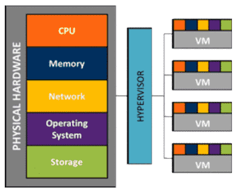

**VMM分类**

- 宿主型：需要运行在Host OS之上，由其提供驱动程序和硬件通信
- 独立监控型：直接运行于硬件之上

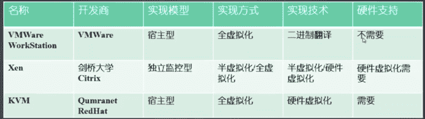

**Hypervisor软件比较**

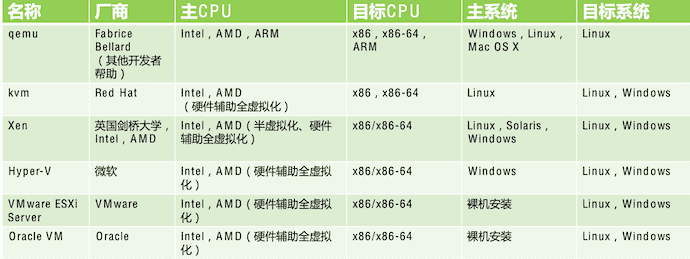

#### 虚拟机（VM）

虚拟计算机系统称为“虚拟机”(VM)，它是一种严密隔离且内含操作系统和应用的软件容器。每个自包含虚拟机都是完全独立的。通过将多台虚拟机放置在一台计算机上，可仅在一台物理服务器或“主机”上运行多个操作系统和应用。

#### Host OS/Guest OS

虚拟机通常叫做**客户机（guest）**，物理机叫**宿主机（host）**

## 虚拟化分类

::: warning

关于虚拟化的分类，没有统一的标准，在不同文章的介绍中也是各不相同。这里参考文章，按照不同的标准进行分类。

具体参考如下：

- 按虚拟对象分类
- 按软件架构分类
- 按VMM实现技术分类
- 按VMM实现结构分类

:::

## 按虚拟对象分类

### **常见类型**

- **基础设施虚拟化**
- **系统虚拟化**
- **软件虚拟化**

> 在VMWare的文档 （[what-is-virtualization](https://www.redhat.com/zh/topics/virtualization/what-is-virtualization)）中还有数据虚拟化的分类；在维基百科中，还有服务虚拟化。所以虚拟化是一个很宽泛的概念，这里的分类只做大概的参考。

### 基础设施虚拟化

- **网络虚拟化**：将网络的硬件与软件资源整合，向用户提供虚拟网络连接的虚拟化技术。分为虚拟局域网（VLAN）虚拟化和虚拟专用网（VPN）。
- **存储虚拟化**：为物理的存储设备提供一个抽象的逻辑视图，用户可以通过这个视频图中的统一逻辑接口来访问被整合的存储资源。分为基于存储设备的存储虚拟化（如磁盘阵列）和基于网络的存储虚拟化（如NAS，SAN）。

*例如*

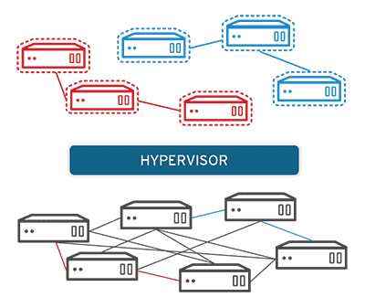

### 系统虚拟化

**核心思想**：使用虚拟化软件在一台物理机上虚拟出一台或多台虚拟机（VM）

- **PC/服务器虚拟化**：系统虚拟化最大的价值所在
- **桌面虚拟化**：解决个人电脑的桌面环境（包括应用程序和文件等）与物理机之间的耦合关系。经过虚拟化的桌面环境被保存在远程的服务器上，当用户使用具有足够显示能力的兼容设备（比如PC，只能手机等）在桌面环境上工作时，所有的程序与数据都运行和最终保存在这个远程的服务器上。

*例如*

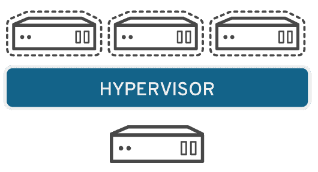

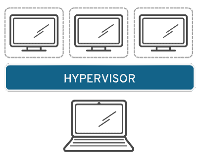

### 软件虚拟化

- **高级语言虚拟化**：解决的是可执行程序在不同体系结构计算机间迁移的问题。由高级语言编写的程序将编译为标准的中间指令，这些指令在解释执行或编译环境中被执行（如Java虚拟机JVM）
- **应用程序虚拟化**：将应用程序与操作系统解耦合，为应用程序提供一个虚拟的运行环境，其中包括应用程序的可执行文件和它所需的运行时环境。应用虚拟化服务器可以实时地将用户所需的程序组件推送到客户端的应用虚拟化运行环境。（如VMWare ThinApp）

### 总结

 

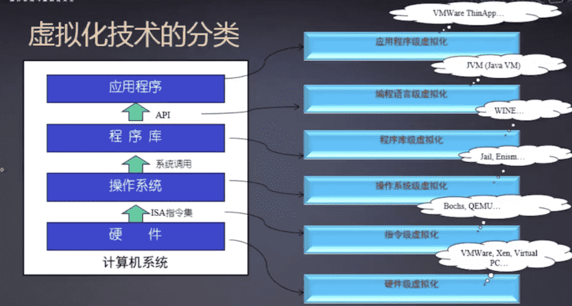

## 按软件架构分类

### 根据在整个系统中的位置

::: warning

在一些文章中出现了如下的分类 - 仅供参考

:::

- **寄居虚拟化架构**：寄居虚拟化架构指在宿主操作系统之上安装和运行虚拟化程序，依赖于宿主操作系统对设备的支持和物理资源的管理。（类似 Vmware Workstation 的程序）
- **裸金属虚拟化架构**：裸金属虚拟化架构指直接在硬件上面安装虚拟化软件，再在其上安装操作系统和应用，依赖虚拟层内核和服务器控制台进行管理。
- **操作系统虚拟化架构**：操作系统虚拟化架构在操作系统层面增加虚拟服务器功能。操作系统虚拟化架构把单个的操作系统划分为多个容器，使用容器管理器来进行管理。宿主操作系统负责在多个虚拟服务器（即容器）之间分配硬件资源，并且让这些服务器彼此独立。
- **混合虚拟化架构**：混合虚拟化架构将一个内核级驱动器插入到宿主操作系统内核。这个驱动器作为虚拟硬件管理器来协调虚拟机和宿主操作系统之间的硬件访问。

*具体如下图*

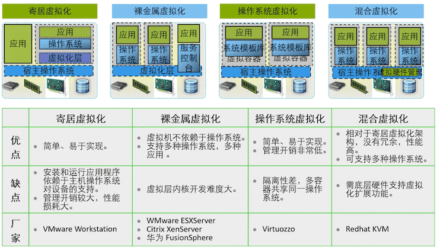

 

### 根据Hypervisor虚拟层架构

- **Type1型虚拟化架构：没有宿主机OS, Hypervisor直接运行在硬件上**
  - Type1（类型1）Hypervisor也叫**native**或**bare-metal Hypervisor**。这类**虚拟化层直接运行在硬件之上**，没有所谓的宿主机操作系统。它们**直接控制硬件资源以及客户机**。典型地如**Xen**和VMware ESX。
- **Type2型虚拟化架构：Hypervisor运行在宿主机操作系统中**
  - Type2（类型2）Hypervisor**运行在一个宿主机操作系统之上**，如VMware Workstation；或**系统**里，如KVM。这类Hypervisor通常就是**宿主机操作系统的一个应用程序**，像其他应用程序一样受宿主机操作系统的管理。比如**VMware Workstation**就是运行在**Windows或者Linux操作系统**上的**一个程序**而已。**客户机**是在**宿主机操作系统**上的**一个抽象**，通常抽象为**进程**。

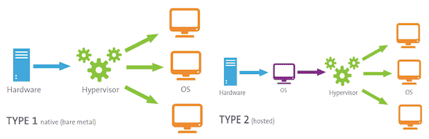

## 按VMM实现技术类型

::: warning

关于实现技术的分类，有些文章把硬件辅助虚拟化也归为全虚拟化。对应为

- 全虚拟化
  - 软件实现的完全虚拟化
  - 硬件辅助完全虚拟化
- 类虚拟化（半虚拟化/泛虚拟化）

:::

> **CPU 虚拟化相关**
>
>  
>
> X86的CPU将特权级别分为4个级别：RING0,RING1,RING2,RING3。Windows只使用其中的两个级别RING0和RING3，RING0只给操作系统用，RING3谁都能用。如果普通应用程序企图执行RING0指令，则Windows会显示“非法指令”错误信息。
>
> ring0是指CPU的运行级别，ring0是最高级别，ring1次之，ring2更次之…… 拿Linux+x86来说， 操作系统（内核）的代码运行在最高运行级别ring0上，可以使用特权指令，控制中断、修改页表、访问设备等等。 应用程序的代码运行在最低运行级别上ring3上，不能做受控操作。如果要做，比如要访问磁盘，写文件，那就要通过执行系统调用（函数），执行系统调用的时候，CPU的运行级别会发生从ring3到ring0的切换，并跳转到系统调用对应的内核代码位置执行，这样内核就为你完成了设备访问，完成之后再从ring0返回ring3。这个过程也称作用户态和内核态的切换。
>
>  
>
> 

>
>  
>
> **特权指令和非特权指令**
>
> 指令集通常可分为非特权指令和特权指令两种。
>
> - 非特权指令不能改变共享资源的值或状态。共享资源包括处理器、内存、计时器和特殊目的的寄存器等。非特权指令如算数运算指令、逻辑运算指令等
> - 特权指令是所有用来访问共享资源的值或状态的指令，这类指令包括关机、设置计时器、设置程序计数器、改变重定位寄存器的值和I/O相关的指令。
>
> **VMM执行非特权指令-可以直接执行；而执行特权指令，则需要仿真执行。**
>
>  
>
> 

>
>  
>
> **虚拟化系统下CPU等级划分的困难**
>
> 为了实现完整的系统功能，必须让它发出的线程是Ring0级的。但为了避免guest os破坏Host OS， Guest OS必须运行在低于0级的权限上。所以虚拟软件要不断协调Guest OS和Host OS之间的线程优先级。必然会增加系统复杂性，导致软件虚拟技术的性能低下（大量耗费COU和内存的处理能力），有数据表明系统性能下降5%-40%

### **全虚拟化（Full Virtualization)**

使用了一种叫做**二进制转换**（binary translation）的技术。其核心是让Hypervisor运行在0环上，由它来负责管理底层的硬件。而虚拟机的操作系统运行在权限较低的1环上，当这些操作系统调用特权指令的时候，0环的VMM使用二进制转换技术奖这些指令调用拦截下来，并负责指令的后续工作。

**缺点**：软件拦截机制，性能开销大

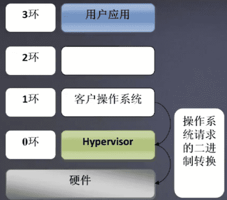

### 泛虚拟化（Para Virtualization）

使得虚拟机的操作系统仍然可以运行在0环上，但是需要修操作系统的内核，把其中对特权指令的调用都改成对Hypervisor的调用，这种调用叫做Hypercall，半虚拟化的典型代表是Xen。这样，当在0环上的虚拟机的操作系统调用特权指令的时候，会转成对Hypervisor的Hypercall调用，依然是由Hypervisor来统一的对系统硬件资源进行管理。

**缺点**：需要修改OS内核

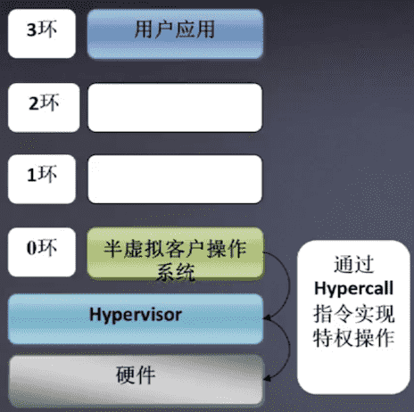

### 硬件辅助虚拟化

需要CPU对虚拟机技术的支持。除了0环到3环以外，CPU额外的多提供了一个环为Hypervisor专用，称为-1环。虚拟机的操作系统仍运行在0环上，在操作系统调用特权指令的时候，通过硬件的机制将特权指令调用转到处在-1环上的Hypervisor上，由Hypervisor完成对硬件的统一管理。

**缺点**：需要有硬件支持（Intel VT, AMD SVM）

> 查看CPU是否支持：Intel（grep “vmx” /proc/cpuinfo）；AMD（grep “svm” /proc/cpuinfo）

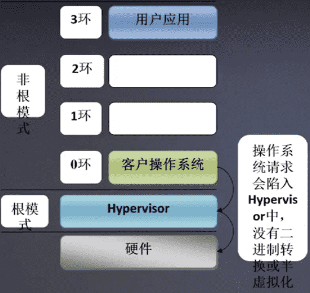

## 按VMM实现架构分类

### Hypervisor模型(Hypervisor VMMs) 

在Hypervisor模型中, **VMM**首先可被看作是一个**完备的操作系统！**, 不过和传统OS不同, **VMM为虚拟化而设计**的, 因此还**具备虚拟化功能**.

从架构看,

- 首先, **所有物理资源**如处理器、内存和I/O设备都归**VMM所有**, 因此, **VMM管理物理资源**;
- 其次, VMM需要**向上提供虚拟机**用于**运行客户操作系统**, 因此, **VMM负责虚拟环境的创建和管理**.

下图展示了Hypervisor的架构, 其中

- **处理器管理代码**(Processor, P)负责**物理处理器的管理和虚拟化！**,
- **内存管理代码**(Memory, M)负责**物理内存的管理和虚拟化！**,
- **设备模型**(Device Model, DM)负责**I/O设备的虚拟化**,
- **设备驱动**(Device Driver, DR)负责**I/O设备的驱动**, 即**物理设备的管理**.

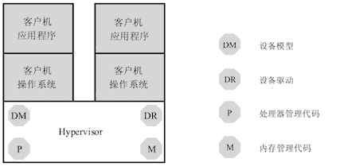

**Hypervisor模型的优点**：

由于VMM同时具备**物理资源的管理功能**和**虚拟化功能**, 所以, **物理资源虚拟化效率更高**. 安全层面, **虚拟机的安全只依赖VMM的安全**. 宿主模型中同时依赖VMM和宿主机OS的安全.

**Hypervisor模型的缺点**:

Hypervisor模型拥有虚拟化高效率同时也有缺点. 由于VMM完全拥有物理资源, 因此, VMM需要进行**物理资源的管理**, 包括**设备的驱动**. 设备驱动工作量很大, 所以基于Hypervisor模型的VMM通常根据市场定位, **选择一些I/O设备来支持**, 而**不是所有**. 此外, 很多功能必须在VMM中**重新实现**, 例如**调度和电源管理等**, 无法像宿主模型那样借助宿主机OS.

### 宿主模型 (OS-hosted VMMs) 

- **物理资源**由**宿主机OS管理**. **宿主机OS**并**不是为虚拟化设计**的, 因此本身不具备虚拟化功能, 有些实现中还包括**用户态进程**, 如负责I/O虚拟化的用户态设备模型.
- **VMM**通过调用**宿主机OS**的服务来**获得资源**, 实现处理器、内存和I/O设备的虚拟化。VMM创建虚拟机后, 通常**将虚拟机**作为**宿主机OS**的**一个进程**参与调度.

下图显示宿主模型架构

- **宿主机OS**拥有**所有物理资源**, 包括I/O设备, 所以**设备驱动位于宿主机操作系统**中.
- VMM(图中**虚拟机管理内核模块**)则包含**处理器虚拟化模块**和**内存虚拟化模块**.

图中**设备模型**实际也是**VMM一部分**, 具体实现中, 可将**设备模型放在用户态**, 也可放在**内核态**.

*宿主模型的VMM*

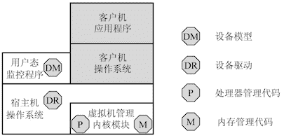

**宿主模型的优点**：

宿主模型的**优缺点**和Hypervisor模型**恰好相反**. 宿主模型**最大优点是能充分利用**现有OS的设备驱动程序, **VMM**无须为各类I/O设备重新实现驱动程序, 可以专注于**物理资源的虚拟化**. 此外, 宿主模型也可利用**宿主机OS**的其它功能, 例如调度和电源管理等, 这都**不需要VMM重新实现**.

**宿主模型的缺点**:

- **VMM**调用**宿主机OS**的服务**获取资源进行虚拟化**, 系统服务设计之初没考虑虚拟化支持, 效率和功能有影响.
- **安全**, 虚拟机的安全同时依赖**VMM和宿主机OS的安全**

> 从架构上看，由Qumranet公司开发的KVM（Kernel-based Virtual Machine）就是属于host模型的，kernel-based，顾名思义就是基于操作系统内核。KVM于2007年被集成到Linux内核2.6.20版本，并于2008年被Red Hat收购。
>
> 随着越来越多的虚拟化功能被加入到Linux内核当中，Linux已经越来越像一个hypervisor了，从这个角度看，KVM也可以算是hypervisor模型了。

### 混合模型(Hybrid VMMs) 

**VMM仍然在最底层**, 拥有**所有物理资源**。与Hypervisor不同的是, VMM会主动让出**大部分I/O设备的控制权**, 将他们交给一个运行在**特权虚拟机**中的**特权操作系统**来控制.

相应, VMM虚拟化的职责也被分担. **处理器和内存的虚拟化**仍然是**VMM**完成, 而**I/O虚拟化**由**VMM和特权操作系统共同合作**完成.

下图显示混合模型

- **I/O设备**由**特权操作系统**控制, 因此, **设备驱动模块**位于**特权操作系统**中.
- **其它物理资源**的管理和虚拟化由**VMM**完成, 因此, **处理器管理代码**和**内存管理代码**在VMM中.

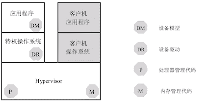

**I/O设备的虚拟化**由**VMM**和**特权操作系统**共同完成, 因此, **设备模型模块**位于特权操作系统中, 并且通过相应的通信机制与VMM合作.

**混合模型的优点**：

混合模型集中了**上面两种模型的优点**. VMM既可利用**现有OS的I/O设备驱动**. VMM直接控制处理器、内存等物理资源, 虚拟化效率比较高。 安全性上, 对特权OS的权限控制得当, 虚拟机**安全性只依赖VMM**.

**混合模型的缺点**:

**特权OS**运行在**虚拟机上**, 当需要**特权OS提供服务**时, VMM需要**切换**, 产生上下文切换开销. **切换频繁**时, **上下文切换开销**会造成性能的明显下降. 出于**性能考虑**, 很多功能还是必须在VMM中实现, 无法借助特权OS, 如调度程序和电源管理等.

> 混合模型的代表有Xen，Intel最近推出的Acrn，以及我国工程师写的minos。
>
> 还有一种划分方法（如上：按软件架构分类）是将VMM分为基于bare-metal的**type-1**和基于OS的**type-2**，从这个角度划分的话，hypervisor模型和混合模型都是属于type-1的，host模型则是属于type-2的。

## 虚拟化与云计算

::: warning

简单帮助理解

（具体云计算，涉及很多知识点）

:::

云计算和虚拟化没有必然的联系，实现云计算可以不需要虚拟化，但是要提高资源的利用效率和方便管理，云计算还是需要用虚拟化来实现的，不过虚拟化技术只是实现云计算的一种方式而已。

*（IaaS层使用了虚拟化技术） - 云计算体系架构*

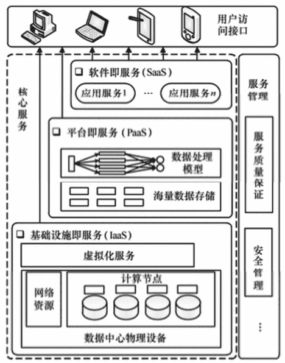

**简单的区别与联系**

- 虚拟化是一种技术，云计算是一种使用模式。
- 虚拟化是指将物理的实体，通过软件模式，形成若干虚拟存在的系统，其实真是运作还是在实体上，只是划分了若干区域或者时域划分
- 云计算的基础是虚拟化，但虚拟化只是云计算的一部分，云计算其实就是在虚拟化出若干资源池以后的应用，但虚拟化并不是只对应云计算的

## 常见的虚拟化技术

### VMware

时在PC上使用比较多的虚拟化是Vmware（一个桌面软件，当然偶尔也会使用Virtual Box，后者是一个开源软件功能依旧很强大），这类软件可以在windows上安装linux虚拟机（用户可以学习linux系统、搭建集群环境等。）且安装完成的虚拟机就是一个文件夹，可以拷贝到任意其他PC电脑上使用，只要那台电脑上也装了Vmwear，等同于一个移动操作系统。但是这仅仅是我们个人在PC端使用的虚拟化软件，如果在企业级服务器上相应的工具又是什么？

Vmwear在服务器端也推出了自己的虚拟化工具，叫做**ESXI**，打开后是一个文本界面，但是它并不是使用最广泛的虚拟化技术，使用最广泛的服务端虚拟化技术是**KVM**和**Xen**。

> KVM是Host OS 中的两个内核模块，且是使用做广泛的开源的hyperviser。但是KVM出现的比较晚，KVM是依赖硬件辅助虚拟化技术实现的，是在06年硬件虚拟化技术出现后才有的。而06年之前使用的是另一个开源的hyperviser，那就是XEN，国内的阿里和国外的AWS都是使用的XEN。Xen是剑桥实验室开发的，对系统修改比较大。目前linux服务器首选KVM（为什么AWS和阿里云没有使用KVM而使用XEN，或许因为他们开始做云计算的时候KVM还不成熟，无法商用 ...）

### XEN

X86不好做虚拟化的根本原因就是虚拟的操作系统中有些指令没有办法执行（特权指令）。KVM是基于硬件辅助虚拟化技术解决的这个问题，但是XEN出现的的时候还没有硬件辅助虚拟化技术，它是怎么解决这个问题的呢？XEN的处理方法就是让虚拟机的操作系统不要去用这些指令。那虚拟机的操作系统不用这些指令，虚拟机怎么工作呢？

XEN给出的解决方案是，当虚拟机用到这些指令时不去调用CPU的指令而是调用xen的hyperviser，它帮你把完成这些指令相应的功能。而这样需要付出的代价就是要改操作系统，把操作系统的内核给改了，让操作系统在遇到这些指令的时候不要去调CPU的指令而是去调用XEN的hyperviser，所以XEN把这种调用叫做HyperCall。因此XEN里面是跑不了widow的虚拟机的，因为没有办法修改windows的内核，但有支持XEN的linux版本。

### KVM

在安装虚拟机时底层跑的是系统（我们PC机上的windows）我们称为Host OS。相应的在linux服务器端，原始装的那个linux系统我们也称为Host OS，在器之上我们安装各种应用，JVM，JCC，Python等等。而**KVM是Host OS中的两个内核模块**，KVM自己主要完成指令集的虚拟化工作和硬件辅助虚拟化技术（就是芯片里面的硬件辅助虚拟化技术，比如interl的NT-x AMD-V配合起来去完成计算虚拟化的功能），此外一台计算机光有计算功能还是不够的，一台计算机还要有外部设备，还有内存的管理，而这样一些功能并不在KVM里面实现，而是在qemu里面实现，所以我们也可以说KVM虚机指的是**KVM和Qemu**在一起实现的虚机。需要注意，每一个虚机在我们的Host OS里面他都是一个进程，跟普通进程的地位是一样的。正如上节提到的，虚拟化与模拟是不一样的，模拟的方式是模拟一个CPU，而程序的指令集先在模拟器上翻译一下，翻译成底层硬件的指令集，在底层硬件上执行，当硬件CPU返回结果以后，他在将底层硬件返回的信息经过模拟器翻译成上层软件的指令集运行。而KVM和硬件辅助虚拟化技术结合起来可以使得指令直接在CPU上执行。

### 其他

另外VMware在服务端的虚拟化技术叫做ESXI,他的架构在本质上跟KVM是非常类似的。

微软的HyperVisor叫做Hyper_V跟Xen比较类似。

## Container的引入

### 虚拟机存在的问题

经过一段时间的使用，人们逐渐意识到这种应用场景存在有一个很严重的问题：虚拟机占用的资源过多，导致服务器资源利用率低。每个虚机里跑的应用占用的资源本身并不多，大量的资源被Guest OS即虚机里面跑的操作系统占用了。例如我只需要在虚拟机里跑一个小的服务，服务本身也就需要几十M，最多几百兆的内存，但是需要为他启一个Windows的虚机，而Windows一启动就是一大坨，只要Windows一启动那至少1、2个G的内存就没了。原本想要的是把服务器隔得越小，灵活性越好，可管理性越好，避免服务之间的干扰。但事实是，我隔得越小导致我浪费的资源越多。 因为隔得越小我需要跑的Guest OS就越多，资源浪费也就越多。

然而，仔细想一想我们为什么要使用操作系统呢？操作系统主要干的事情是管理计算、存储、网络等等这样一些硬件设备 ，并且能在里面调度进程。实现一些具体的应用。然而操作系统干的事情，跟我们之前的需求：利用虚拟化将一个物理服务器隔离成多个资源之间彼此隔离的虚拟机，将应用放在一个个小的虚拟机环境里面去运行，应用之间相互之间不影响可以很灵活的调度资源。所以我们想要的理想的情况就是：我们可以随时创建一个小格出来（前面就是指虚机），且随时可以销毁释放资源，且各个小格子之间还有隔离型，互相之间不影响。虚机之所以被广泛应用就是因为虚机可以满足这样的需求，而不是因为虚机可以模拟一个完整的机器。这里就引出一个对虚拟机的反思，我们使用软件完全实现一个物理世界的硬件环境，有没有太大的必要 ？ 之前曾提到过，为甚么要模拟一个真实存在的IO设备呢，你的真正目的是为了实现IO，实现输入输出。如果我们纯粹为虚拟化设计一个虚拟的IO设备行不行呢？当然是可以的，我们只需要将操作系统的驱动改成虚机化的IO的驱动就可以了。**其实我们要的并不是实现一个完整的把所有物理的硬件都模拟一遍的虚拟服务器，而是一个相对完整的操作系统环境**。

举个例子，假如一个小格里面只跑一个Hadoop的DataNode那我有没有必要再给这个东西接个显示器？你接个显示器干嘛呢？？桌面虚拟化可能需要接显示器，但是DataNode接个显示器你能看什么？完全没有必要。这样就少了一个外部设备。还有一些其他的诸如此类的考虑。最后你就会发现其实我们要的只是一个相对完整的操作系统的环境，而不是一个完完全全的跟物理服务器一样的包括所有物理硬件的模拟的环境 。既然我们只需要一个相对完整的操作系统的环境 ，那能不能直接利用在物理硬件上跑的那个操作系统（我们称之为Host OS）来支持呢？即因为我们只需要一个相对完整的操作系统，那我们能否直接虚拟操作系统，不需要虚拟那些物理的硬件。最后，总结一下就是两个问题：

1. ***资源的隔离，使得应用之间对资源的使用相互之间不干扰。***
2. ***提供一个相对完整的操作系统的环境，而不是一个完整的模拟的硬件环境。***

此时人们就在想，能不能直接使用Host OS，来模拟一个相对完整的操作系统，而不需要再在Host OS上跑Guest OS，于是就发展出来了操作系统级的虚拟化技术，就是利用操作系统本身的功能来实现虚拟化，**这就是Container技术** 。Container技术其实也是一条完整的线，经过了很长时间的发展，到今天他跟虚拟机的HyperVisor之间的发展也是错综复杂的一个关系，并不是说Container技术出现了HyperVisor技术就利用起来了 ，Container很早就出现了，HyperVisor也一直在发展。

