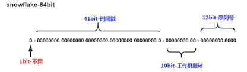

介绍一些全局唯一ID的生成方案

<!-- more -->

## 全局唯一ID生成方案

::: tip 参考

- [https://cloud.tencent.com/developer/article/1434253](https://cloud.tencent.com/developer/article/1434253)
- [https://zhuanlan.zhihu.com/p/105900542?from=singlemessage](https://zhuanlan.zhihu.com/p/105900542?from=singlemessage)
- [https://blog.csdn.net/qq_43460335/article/details/107770429](https://blog.csdn.net/qq_43460335/article/details/107770429)

:::

首先，并不是所有系统都需要去生成全局唯一ID的。全局唯一ID的需求，是随着分布式、微服务的流行，变成了一个基础功能。如果你的项目还是单体项目，或者说项目体量很小，用着单一数据库，那可能大概率没有必要考虑全局唯一ID这件事。数据库自增方案（例如MSSQL、mysql等）就能很好的解决这个问题。再来就是，全局唯一ID的设计还要结合系统自身的需求，进行相应的变化（例如加上逻辑含义的字段，有无排序的需求等）。

*下面的方案都是一些经典基础的方案，仅供参考*

### 数据库自增

利用数据库的自增特性，以MySQL举例，利用给字段设置`auto_increment_increment`和`auto_increment_offset`来保证ID自增，且全局唯一。

**优点**：

- 可控，简单
- 严格递增
- 纯数字
- 不依赖第三方，仅数据库自身

**缺点**：

- 依赖数据库，由于数据库生成过程存在阻塞，所以性能存在瓶颈

> 此方案仅适用对性能要求不高，且必须为纯数字递增的场景，如用户id

> 在某些简单的案例中，这种设计也能解决分布式 **分库分表** 的问题，如下每个表从不同的数字开始自增、使用相同的步长。这样就解决了简单的由单表过大导致的性能问题 （对于分库分表，利用负载均衡的访问方式就能达到不错的效果）
>
> <br />
>
> *假设我们分出来3张表*：
>
> |      | 初始值 | 步长 | 生成的id         |
> | ---- | ------ | ---- | ---------------- |
> | 表1  | 0      | 3    | 0、3、6、9、...  |
> | 表2  | 1      | 3    | 1、4、7、10、... |
> | 表3  | 2      | 3    | 2、5、8、11、... |
>
> <br />
>
> 但这种设计缺点也很明显 - 
>
> - 不够灵活，一旦设计好了就固定了，无法添加节点、扩展。
> - 所有的实现基于数据库的解决方案。性能有上线，也无法迁移等。。

### UUID

UUID是通用唯一识别码（Universally Unique Identifier）的缩写，**UUID的组成部分:当前日期+时钟序列+随机数+全局唯一的IEE机器识别号**（**全局唯一的IEE机器识别号:如果有网卡,从网卡MAC地址获取,没有网卡从其他方式进行获取**），因此可以做到全局唯一。Java本身提供UUID类，因此使用UUID可以满足不重复、高性能、高可用三方面的要求。

**优点**：

- 使用简单方便
- 不依赖第三方，完全基于本地jdk的能力，且生成过程不存在阻塞，天然满足了高性能和高可用的要求。

**缺点**：

- 无序，如果业务中对id有顺序要求，如趋势递增，则无法满足。
- 不能反解析出信息、太长、占用空间大（不适用于一些有严格要求的场合，而且id生成出来是数字+英文的组合，不适用于一些场景）

> 因此，此方案非常适合对id无顺序、无长度和无纯数字要求的场景，比如在分布式应用场景中，为了排查问题方便，多个服务之间会使用一个唯一id串起来整个请求的链路，比如对于TCP长连接协议的服务端，需要一个连接id标识每个连接。
>
> 又比如生成token的场景(去掉"-"符号)
>
> <br />
>
> 为了解决排序问题 - UUID的变种，增加一个时间拼接，但是会造成id非常长

> **使用UUID导致 - 入数据库性能差：**
>
> 为什么无序的UUID会导致入库性能变差呢?<br />
> **1、无序**，无法预测他的生成顺序，不能生成递增有序的数字。首先分布式id一般都会作为主键，但是安装**mysq|官方推荐主键要尽量越短越好**，UUID每一个 都很长，所以不是很推荐。<br />
> **2、主键**，ID作为主键时在特定的环境会存在一些问题。比如做DB主键的场景下，UUID就非常不适用，MySQL官方有明确的建议主键要尽量越短越好36个字符长度的UUID不符合要求
>
> > All indexes other than the clustered index are known as secondary
> > indexes. In InnoDB, each record in a secondary index contains the
> > primary key columns for the row, as well as the columns specified for
> > the secondary index. InnoDB uses this primary key value to search for
> > the row in the clustered index.*** If the primary key is long, the
> > secondary indexes use more space, so it is advantageous to have a
> > short primary key+**.
>
> **3、索引**，B+树索引的分裂，既然分布式id是主键，然后主键是包含索引的，然后mysq|的索引是通过b+树来实现的，每一次新的UUID数据的插入， 为了查询的优化，都会对索引底层的b+树进行修改，因为UUID数据是无序的，所以每一次UUID数据的插入都会对主键地城的b+树进行很大的修改，这一点很不好。插入完全无序，不但会导致一些中间节点产生分裂，也会白白创造出很多不饱和的节点，这样大大降低了数据库插入的性能。

### Snowflake算法方案

twitter在把存储系统从MySQL迁移到Cassandra的过程中由于Cassandra没有顺序ID生成机制，于是自己开发了一套全局唯一ID生成服务：Snowflake。snowflake只是提供了一种算法思路，在实际应用中我们可以借鉴其算法模型生成满足自己要求的全局唯一id。

算法介绍：

*snowflake算法把时间戳，工作机器id，序列号组合在一起。总共64bit，设计如下*：

<div style="display:flex;"></div>

- 63位：预留（说是二进制里面最高位是1的是负数，我们用0表示正数就好了。）
- 62-22位：时间戳。使用了41bit。最大值2^41=2 199 023 255 552（单位：ms），意味着在设定的起始时间之后的这么多时间内我们可以制造ID。是多久呢？一年按365天算，2^41 / 1000 / 3600 / 24 / 365 ≈ 69.7（年）。
- 21-12位：机器id。使用10位标识机器信息，如机房信息，节点id信息，进程号，端口号信息等。最大值2^10=1024。 -**<font color=red> 可以通过部署多个ID生成器，为各个业务系统生成全局唯一的Long型ID</font>**。
- 11-0位：自增数。使用12bit作为自增数，范围为0~4098

> 如上所说，snowflake只是提供了一种算法思路，snowflake算法可以根据自身项目的需要进行一定的修改。比如估算未来的数据中心个数，每个数据中心的机器数以及统一毫秒可以能的并发数来调整在算法中所需要的bit数

**优点**：

- 生成过程没有阻塞 - 高性能，低延迟
- 高位是时间戳，所以整体有序
- 独立应用，不依赖第三方（同UUID）

**缺点**：

- 需要独立开发部署id生成器
- 机器时间可以回拨，**有潜在风险**

> 此方案适用于在UUID不能满足的场景下，可以优先考虑的方案，如订单号，聊天消息id等等。

*FYI -snowflake Java实现源码*

``` java
/**
 * Twitter_Snowflake<br>
 * SnowFlake的结构如下(每部分用-分开):<br>
 * 0 - 0000000000 0000000000 0000000000 0000000000 0 - 00000 - 00000 - 000000000000 <br>
 * 1位标识，由于long基本类型在Java中是带符号的，最高位是符号位，正数是0，负数是1，所以id一般是正数，最高位是0<br>
 * 41位时间截(毫秒级)，注意，41位时间截不是存储当前时间的时间截，而是存储时间截的差值（当前时间截 - 开始时间截)
 * 得到的值），这里的的开始时间截，一般是我们的id生成器开始使用的时间，由我们程序来指定的（如下下面程序IdWorker类的startTime属性）。41位的时间截，可以使用69年，年T = (1L << 41) / (1000L * 60 * 60 * 24 * 365) = 69<br>
 * 10位的数据机器位，可以部署在1024个节点，包括5位datacenterId和5位workerId<br>
 * 12位序列，毫秒内的计数，12位的计数顺序号支持每个节点每毫秒(同一机器，同一时间截)产生4096个ID序号<br>
 * 加起来刚好64位，为一个Long型。<br>
 * SnowFlake的优点是，整体上按照时间自增排序，并且整个分布式系统内不会产生ID碰撞(由数据中心ID和机器ID作区分)，并且效率较高，经测试，SnowFlake每秒能够产生26万ID左右。
 */
public class SnowflakeIdWorker {
 
    // ==============================Fields===========================================
    /** 开始时间截 (2015-01-01) */
    private final long twepoch = 1420041600000L;
 
    /** 机器id所占的位数 */
    private final long workerIdBits = 5L;
 
    /** 数据标识id所占的位数 */
    private final long datacenterIdBits = 5L;
 
    /** 支持的最大机器id，结果是31 (这个移位算法可以很快的计算出几位二进制数所能表示的最大十进制数) */
    private final long maxWorkerId = -1L ^ (-1L << workerIdBits);
 
    /** 支持的最大数据标识id，结果是31 */
    private final long maxDatacenterId = -1L ^ (-1L << datacenterIdBits);
 
    /** 序列在id中占的位数 */
    private final long sequenceBits = 12L;
 
    /** 机器ID向左移12位 */
    private final long workerIdShift = sequenceBits;
 
    /** 数据标识id向左移17位(12+5) */
    private final long datacenterIdShift = sequenceBits + workerIdBits;
 
    /** 时间截向左移22位(5+5+12) */
    private final long timestampLeftShift = sequenceBits + workerIdBits + datacenterIdBits;
 
    /** 生成序列的掩码，这里为4095 (0b111111111111=0xfff=4095) */
    private final long sequenceMask = -1L ^ (-1L << sequenceBits);
 
    /** 工作机器ID(0~31) */
    private long workerId;
 
    /** 数据中心ID(0~31) */
    private long datacenterId;
 
    /** 毫秒内序列(0~4095) */
    private long sequence = 0L;
 
    /** 上次生成ID的时间截 */
    private long lastTimestamp = -1L;
 
    //==============================Constructors=====================================
    /**
     * 构造函数
     * @param workerId 工作ID (0~31)
     * @param datacenterId 数据中心ID (0~31)
     */
    public SnowflakeIdWorker(long workerId, long datacenterId) {
        if (workerId > maxWorkerId || workerId < 0) {
            throw new IllegalArgumentException(String.format("worker Id can't be greater than %d or less than 0", maxWorkerId));
        }
        if (datacenterId > maxDatacenterId || datacenterId < 0) {
            throw new IllegalArgumentException(String.format("datacenter Id can't be greater than %d or less than 0", maxDatacenterId));
        }
        this.workerId = workerId;
        this.datacenterId = datacenterId;
    }
 
    // ==============================Methods==========================================
    /**
     * 获得下一个ID (该方法是线程安全的)
     * @return SnowflakeId
     */
    public synchronized long nextId() {
        long timestamp = timeGen();
 
        //如果当前时间小于上一次ID生成的时间戳，说明系统时钟回退过这个时候应当抛出异常
        if (timestamp < lastTimestamp) {
            throw new RuntimeException(
                    String.format("Clock moved backwards.  Refusing to generate id for %d milliseconds", lastTimestamp - timestamp));
        }
 
        //如果是同一时间生成的，则进行毫秒内序列
        if (lastTimestamp == timestamp) {
            sequence = (sequence + 1) & sequenceMask;
            //毫秒内序列溢出
            if (sequence == 0) {
                //阻塞到下一个毫秒,获得新的时间戳
                timestamp = tilNextMillis(lastTimestamp);
            }
        }
        //时间戳改变，毫秒内序列重置
        else {
            sequence = 0L;
        }
 
        //上次生成ID的时间截
        lastTimestamp = timestamp;
 
        //移位并通过或运算拼到一起组成64位的ID
        return ((timestamp - twepoch) << timestampLeftShift) //
                | (datacenterId << datacenterIdShift) //
                | (workerId << workerIdShift) //
                | sequence;
    }
 
    /**
     * 阻塞到下一个毫秒，直到获得新的时间戳
     * @param lastTimestamp 上次生成ID的时间截
     * @return 当前时间戳
     */
    protected long tilNextMillis(long lastTimestamp) {
        long timestamp = timeGen();
        while (timestamp <= lastTimestamp) {
            timestamp = timeGen();
        }
        return timestamp;
    }
 
    /**
     * 返回以毫秒为单位的当前时间
     * @return 当前时间(毫秒)
     */
    protected long timeGen() {
        return System.currentTimeMillis();
    }
 
    //==============================Test=============================================
    /** 测试 */
    public static void main(String[] args) {
        SnowflakeIdWorker idWorker = new SnowflakeIdWorker(0, 0);
        for (int i = 0; i < 1000; i++) {
            long id = idWorker.nextId();
            System.out.println(Long.toBinaryString(id));
            System.out.println(id);
        }
    }
}

```


### Redis

当使用数据库来生成ID性能不够要求的时候，我们可以尝试使用Redis来生成ID。这主要依赖于Redis是单线程的（*新版本可能支持多线程了*），所以也可以用生成全局唯一的ID。可以用Redis的原子操作INCR和INCRBY来实现。

**优点**：

- 使用简单，高性能（大大优于数据库）
- 纯数字，严格递增，有序
- 使用Redis集群也可以防止单点故障的问题

**缺点**：

- 依赖redis，增加系统复杂度（系统架构复杂度，同时需要**redis集群**保证高可用）

> 此方案适用于生成纯数字，且递增，并对性能有较高要求的场景，但是依赖redis，需要考虑与其他业务共用redis存在的问题，比如持久化可能会影响redis性能等。

> 可以使用Redis集群来获取更高的吞吐量。假如一个集群中有5台Redis。可以初始化每台Redis的值分别是1,2,3,4,5，然后步长都是5。各个Redis生成的ID为：
>
> A：1,6,11,16,21
>
> B：2,7,12,17,22
>
> C：3,8,13,18,23
>
> D：4,9,14,19,24
>
> E：5,10,15,20,25
>
> 比较适合使用Redis来生成每天从0开始的流水号。比如订单号=日期+当日自增长号。可以每天在Redis中生成一个Key，使用INCR进行累加。


### 其他

> to be added ...

#### **MongoDB的ObjectId**

#### Flicker的解决方案

#### 百度开源分布式唯一ID生成器UidGenerator

#### Leaf - 美团点评分布式ID生成器

