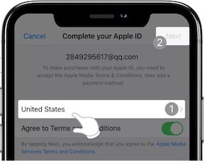
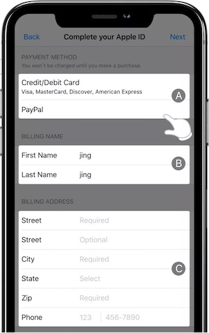

在之前的文章 <a href="/blogs/2020/0620-ios安装外网app.html">ios安装外网app相关</a> 中, 我们已经描述了在**ios下切换apple id下载其它国家和地区的应用**的原理和方法，也给了示例。本文继续之前遗留的问题 - 如何自己申请美区APPLE ID, 并使用此ID下载美区apple store应用。

当前日期测试有效！

<!-- more -->

## IOS账号描述

::: warning 概念

苹果设备允许`icloud`和`app store`使用不同的账号登录， 退出`icloud`账号需要密码，而退出`app store`则不需要。

**icloud账号权限非常高，可以远程锁定和抹除登录了同一个账号的设备；app store的账号可用来下载、付费订阅软件，除了付款方式不涉及其它隐私信息。**

所以要想到外区`app store`获取ios科学上网客户端以及 V2Ray客户端。我们可以不绑定`icloud账号`而只申请外区`app store id`或者借用别人的`app id`即可。

:::

## 前提

在这之前，有一个前提就是你可以**科学上网**，至于怎么科学上网，请参考其他文章 ~

## 注册账号

可以自由上网之后，我们正式开始注册APPLE ID

- 手机上访问appid官网 [https://appleid.apple.com/us/](https://appleid.apple.com/us/)
- 拉到最下面
  - 右下角，显示地址确保为“*United States*”
  - 然后点击 “[Create your Apple ID](https://appleid.apple.com/account)”
- 填写注册资料和信息 [其他信息正常填写就行 - 关注以下几点]
  - country 选  “*United States*”
  - 邮箱可以用gmail邮箱 (未使用过的)
  - phone number 
    > 美国手机号可以从[https://smsreceivefree.com/](https://smsreceivefree.com/)免费获取
    >
    >  
    >
    > 选择美国，然后选择最近add的一个号码（否则，苹果有可能会提示，此号码被使用太多次数）
    >
    > - 填写号码
    > - 进去后，后面发短信什么的就是 “refresh page” 就行了
    >
    >  
    >
    > ::: warning Updated later - 
    >
    > **貌似这里可以直接填写国内的手机号** 我本人是后来登录 [https://appleid.apple.com/](https://appleid.apple.com/)， 将上面的号码改成了国内号码 - 验证可行！
    >
    > :::
 - continue
   
   > 可以去掉几个没用的勾选，以防邮件泛滥 ...
 - 之后就是按照提示，输入邮箱验证码
 - 然后输入手机短信验证码 
   
   > 刷新之前的页面，查看验证码
 - contine 提示 apple id 创建成功

## 切换手机账号

具体操作可参考 <a href="/blogs/2020/0620-ios安装外网app.html">ios安装外网app相关</a> 一文，切换账号就行

> 简单过程就是：
>
> - 打开设置
> - 进入个人设置界面
> - 点击 “**媒体与购买项目**”
>   - 弹出界面，点击 “**退出登录**”
> - 此时 再回到个人设置界面 可以看到  “**媒体与购买项目**” 显示关
> - 再次点击 “**媒体与购买项目**” 弹出登录界面
> - 选择 “**不是 xxx**”
> - 输入 新注册的 账号密码 登录即可

## 下载美区App

初次使用新id下载时，会弹出“*The Apple ID has not yet been used in the iTunes Store...*”确认框

- 点击 “**Review**” 进入激活页面
- 再弹出界面中 选择 “**United States**”， 选中 **Agree** 按钮， 点击 “**Next**”
  
  

- 填写付款方式、姓名及地址资料 >> 点击 Next，登录进 App Store 代表激活成功。
  

  > 区域A：此处为付款方式选择，注意这里不要选择任何付款方式，有的版本有 None 选项的，选择None
  >
  > 区域B：此处为姓名填写，默认为之前注册的姓名
  >
  > 区域C：此处为地址与电话信息。填写第一个 Street 为街道地址，必填字段；第二个 Street 可以不填 ； City 为城市；State 为州；Zip 为邮编；Phone 为电话号码。您可以使用附录中的方法获取一个虚拟的美国地址与电话信息。

***附录***

> **如何生成美国虚拟地址与电话信息**
>
> 在百度中搜索“美国地址生成器” >> 在结果中选择一家可以生成美国虚拟身份信息的网站进行生成即可。